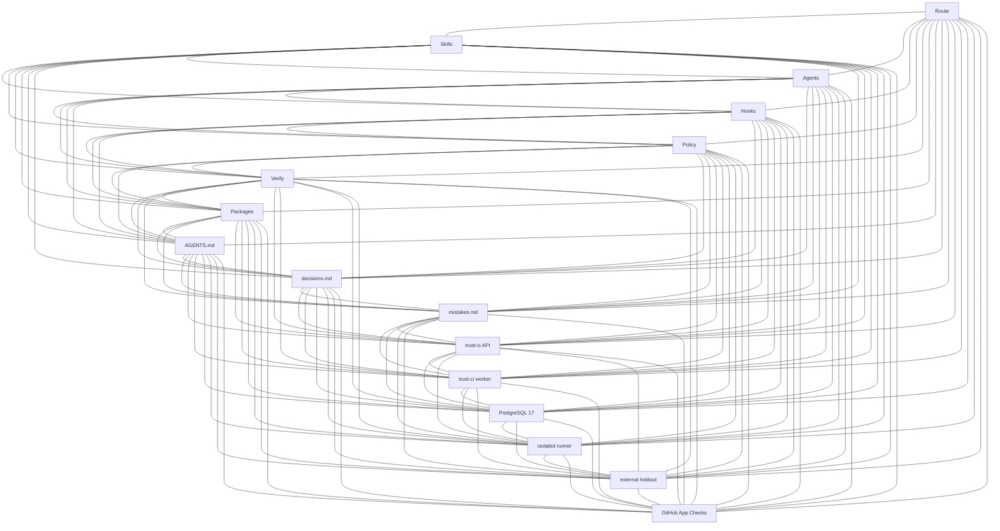

# Adaptive Grok Build Pro v2.0.12

A commercial-grade product for **Grok Build** — free of charge, public, and MIT-licensed.

## Current state

- Identity: **2.0.12** (`VERSION`, README H1). Published GitHub Release is `v2.0.12`.
- Standing contract: [AGENTS.md](AGENTS.md) — first section is agent self-learning into [decisions.md](decisions.md) / [mistakes.md](mistakes.md); delivery is PR-only and merge trust comes from the App-owned policy-epoch check `adaptive-trust-ci/verified@<policy-sha12>` on the exact pull-request SHA.
- Local quality gate: `python3 scripts/grok_verify.py --mode pr` plus route-selected reviews. These are preflight evidence, not merge authority.
- Independent CI candidate: [`trust-ci/`](trust-ci/) — self-hosted API/worker, PostgreSQL durable jobs, Ed25519 approvals and attestations, external holdout validation, isolated no-network runner containers, GitHub App Checks API and app-bound branch protection. **No GitHub Actions.**
- Trust CI service identity is **2.1.0** (`trust-ci/pyproject.toml`); it is not product `2.0.12`. The App-owned check is not live in this release; merge of PR #2 is a bootstrap exception (see decisions.md).
- Do not add `pyproject.toml` / `requirements.txt` / `setup.py` at repository root (flips repo detect). `trust-ci/pyproject.toml` is intentionally scoped to the independent service.
- Optional SEO side project: [`.agents/skills/seo-landing/`](.agents/skills/seo-landing/) provides repository-scoped `$seo-landing` generation/audit/fix modes; [`side-projects/seo-landing-showcase/`](side-projects/seo-landing-showcase/) is its Russian static showcase and stays non-indexable until a production origin is supplied.

## Read first

1. [AGENTS.md](AGENTS.md)
2. [decisions.md](decisions.md)
3. [mistakes.md](mistakes.md)
4. [CHANGELOG.md](CHANGELOG.md)
5. [QUICKSTART.md](QUICKSTART.md)
6. [`trust-ci/README.md`](trust-ci/README.md)
7. `.grok-stack/runtime/active-route.json` (live route; not product identity or merge authority)
8. This README’s stack graph and map

## How work runs

Source-of-truth order is in AGENTS.md. Large work is split into small subtasks that share `decisions.md` / `mistakes.md`. Local loop: route → change package → one write owner → if the product changed, `grok_verify --mode pr` and independent local reviews → `ready` → branch and pull request. The deployed Trust CI service verifies the exact PR SHA under server-side policy, executes an external holdout bundle before repository checks, rejects source mutation, checks signed human approval scopes, signs the attestation, and publishes `adaptive-trust-ci/verified@<policy-sha12>` through its GitHub App. A human owns merge, tag and production promotion.

## Map

- [AGENTS.md](AGENTS.md)
- [decisions.md](decisions.md)
- [mistakes.md](mistakes.md)
- [CHANGELOG.md](CHANGELOG.md)
- [QUICKSTART.md](QUICKSTART.md)
- [VERSION](VERSION)
- [`.grok/skills/`](.grok/skills/)
- [`.grok/agents/`](.grok/agents/)
- [`.grok/hooks/`](.grok/hooks/)
- [`scripts/grok_route.py`](scripts/grok_route.py)
- [`scripts/grok_change.py`](scripts/grok_change.py)
- [`scripts/grok_verify.py`](scripts/grok_verify.py)
- [`scripts/grok_review.py`](scripts/grok_review.py)
- [`scripts/grok_approve.py`](scripts/grok_approve.py) — exact action/resource delegated local grant only
- [`scripts/grok_deploy.py`](scripts/grok_deploy.py)
- [`scripts/grok_doctor.py`](scripts/grok_doctor.py)
- [`scripts/install_into.py`](scripts/install_into.py)
- [`trust-ci/`](trust-ci/) — external merge trust, deployed independently
- [`engineering/runbooks/`](engineering/runbooks/)
- [`packages/`](packages/)
- [`examples/bitrix-module/`](examples/bitrix-module/)
- [`.agents/skills/seo-landing/`](.agents/skills/seo-landing/) — optional Codex SEO landing skill
- [`side-projects/seo-landing-showcase/`](side-projects/seo-landing-showcase/) — non-indexable Russian showcase
- [LICENSE](LICENSE)

## What this is

- Task routing + domain skills (Bitrix, API/events, data, frontend, security, incidents, …)
- Quality profiles and change packages under `engineering/changes/`
- Local verification / review receipts via `scripts/grok_*.py`
- Multi-agent discipline described in `AGENTS.md`
- `AGENTS.md` starts with the self-learning rule and writes to `decisions.md` / `mistakes.md`
- Optional independently deployed Trust CI that removes merge trust from prompts, agents and local runtime
- GitHub App-owned policy-epoch Checks, external holdout validation and signed exact-SHA attestations

## Stack graph

Simple complete graph: every listed core node is linked to every other with a `---` edge. The listed set is the local Grok workflow plus the independently deployed Trust CI applications and PostgreSQL. Prompts, local receipts and delegated grants are not merge authority.



| Node | Role |
| --- | --- |
| Route | `scripts/grok_route.py` / active-route |
| Skills | `.grok/skills/` and `.agents/skills/` |
| Agents | `.grok/agents/` |
| Hooks | `.grok/hooks/` |
| Policy | `.grok-stack/adaptive_grok/policy.py` |
| Verify | `scripts/grok_verify.py` + local receipts |
| Packages | `packages/` + `scripts/package_stack.py` |
| Contract | `AGENTS.md` first rule: log to `decisions.md` / `mistakes.md` |
| Decisions | root `decisions.md` |
| Mistakes | root `mistakes.md` |
| TrustAPI | `trust-ci/` FastAPI image; HMAC webhook intake; no GitHub App key |
| TrustWorker | `trust-ci/` worker; claims PostgreSQL leases; publishes the Check Run |
| Postgres | Durable PostgreSQL 17 (`TRUST_CI_POSTGRES_IMAGE`); jobs, leases, approvals, attestations |
| Runner | Isolated no-network runner container; `policy.sandbox.image` must equal `TRUST_CI_RUNNER_IMAGE` |
| Holdout | External digest-pinned bundle, outside the PR checkout |
| GitHubApp | App-owned Checks `adaptive-trust-ci/verified@<policy-sha12>` bound to the App ID |

oneshots `migrate` / `runner-loader` reuse API/worker images; privileged rootless DinD is an execution edge of Runner.

## Requirements

Pins are **minimum or newer**. `built` is the version this local stack was verified on. If a tool is missing or older than minimum, `python3 scripts/grok_doctor.py` prints an **install offer** for the fallback (or install a newer version).

| Tool | Minimum | Built | Fallback | Required |
| --- | --- | --- | --- | --- |
| Python 3 | 3.10 | 3.12.3 | 3.12 | yes |
| Git | 2.34 | 2.43.0 | 2.43 | yes |
| Grok Build CLI | 1.0.0 | 1.0.5 | 1.0.5 | for the TUI |
| GitHub CLI (`gh`) | 2.40 | 2.86.0 | 2.86 | for human-owned GitHub Release |
| Node.js | 18 | 24.19.0 | 20 LTS | frontend profiles |
| npm | 9 | 11.17.0 | 10 | frontend profiles |
| PHP | 8.1 | 8.2 | 8.2 | PHP/Bitrix profiles |
| Composer | 2.2 | 2.7 | 2.7 | PHP/Bitrix profiles |
| Docker Engine | 24.0 | 29.7.2 | 29 | Trust CI host (optional) |
| Syft | 1.0 | 1.51.0 | 1.51 | supply-chain SBOM (optional) |
| Trivy | 0.50 | 0.74.0 | 0.74 | supply-chain vuln scan (optional) |
| Cosign | 2.0 | — | 2.4 | supply-chain sign/verify (optional) |

```bash
python3 scripts/grok_doctor.py --offer-install
```

Machine-readable local pins: `.grok-stack/config/toolchain.json`. Trust CI uses separately built API, worker and runner images pinned by immutable SHA-256 digest in deployment and server policy.

## Install into a project

```bash
# from this package root — copies the local stack and installs missing required tools
python3 scripts/install_into.py /path/to/your/repo
# skip host installs: --no-deps
# also PHP/Node/gh: --all-deps
```

Or copy manually:

```text
.grok/            → project .grok/          (config, hooks, agents, skills)
.agents/skills/   → project .agents/skills/
.grok-stack/      → project .grok-stack/
scripts/          → project scripts/
AGENTS.md         → project AGENTS.md
decisions.md      → project decisions.md
mistakes.md       → project mistakes.md
engineering/      → project engineering/  (if empty scaffold needed)
```

Then in the project:

```bash
cd /path/to/your/repo
grok inspect    # should see skills + AGENTS.md
grok            # start TUI
```

Invoke the main controller skill:

```text
/adaptive-delivery
```

or just describe a development task — Grok should pick up skills from `.grok/skills/`.

The independent `trust-ci/` service is deployed once as infrastructure; it is not copied into every consumer unless that repository will use the same external check protocol.

## Scripts

Local loop: route → change → verify → independent reviews → `ready` → pull request. `scripts/grok_deploy.py` is prepare-only and must not bypass protected-branch or exact-SHA requirements.

| Script | Role |
|--------|------|
| `scripts/grok_route.py` | Classify / show route |
| `scripts/grok_change.py` | Start durable local change package |
| `scripts/grok_status.py` | Local runtime status |
| `scripts/grok_verify.py` | Local verification preflight (unittest, Ruff, Bandit, measured coverage in `pr`/`release`) |
| `scripts/grok_review.py` | Record local review receipt |
| `scripts/grok_approve.py` | Delegated local action/resource grant bound to repository, route, change, exact HEAD and tree fingerprint; not accepted by Trust CI |
| `scripts/grok_deploy.py` | Prepare-only human last mile |
| `scripts/grok_doctor.py` | Local health check |
| `scripts/install_into.py` | Install local stack into target repo |
| `adaptive-trust-ci` | External API, worker, migration, signed approvals, holdout verification, attestation verification and app-bound branch protection |

## Hooks

Lifecycle adapters live in `.grok/hooks/` and are registered in both:

- `.grok/hooks.json` — doctor/structure contract (`command` + `commandWindows`)
- `.grok/hooks/adaptive.json` — Grok project-hook discovery

Trust the folder once (`/hooks-trust` or `grok --trust`). Hooks classify prompts and enforce local policy (secrets, Bitrix core, destructive commands, control-plane mutations, and exact delegated side-effect grants). Hook failure remains fail-open to avoid locking an interactive agent; this is why hooks are not merge authority. External Trust CI remains fail-closed for the App-owned required Check Run.

## Package

```bash
python3 scripts/package_stack.py
```

Default output is `dist/adaptive-grok-build-pro-v<VERSION>.zip` (gitignored scratch). Published copies live in `packages/` and on the GitHub Release. Zip members use the prefix `adaptive-grok-build-pro/`.

## Bitrix

See skills under `.grok/skills/bitrix-development/` and example module in `examples/bitrix-module/`.

## License

**MIT.** A commercial product that is free of charge: use, copy, modify, and ship it. The repository is public. No EULA, no paid tier. Local checks: `make doctor` / `make verify` / `make trust-ci-test`. Merge trust, when deployed, is the App-owned policy-epoch exact-SHA check described in [`trust-ci/README.md`](trust-ci/README.md).
