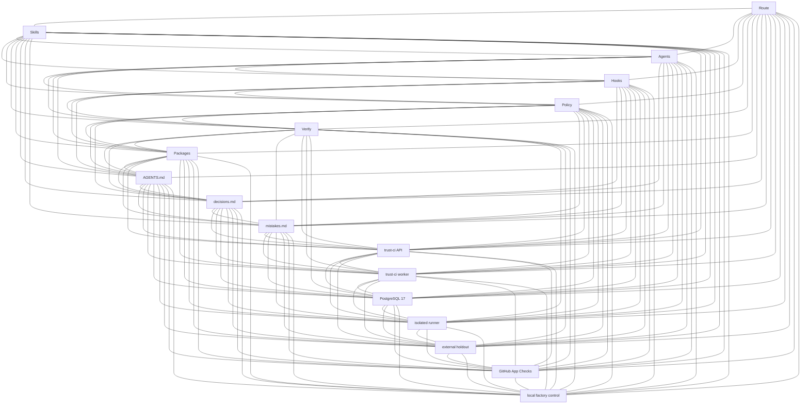

# Adaptive Grok Build Pro v2.0.12

A commercial-grade product for **Grok Build** — free of charge, public, and MIT-licensed.

## Current state

- Identity: **2.0.12** (`VERSION`, README H1). Published GitHub Release is `v2.0.12`.
- Standing contract: [AGENTS.md](AGENTS.md) — first section is agent self-learning into [decisions.md](decisions.md) / [mistakes.md](mistakes.md); delivery is PR-only and merge trust comes from the App-owned policy-epoch check `adaptive-trust-ci/verified@<policy-sha12>` on the exact pull-request SHA.
- Local quality gate: `python3 scripts/grok_verify.py --mode pr` plus route-selected reviews. These are preflight evidence, not merge authority.
- M1 typed intent is locally source-ready: canonical schema-v2 specs, route-driven generation, strict bounded validation, criterion-bound receipts, and `scripts/grok_spec.py` summary/coverage commands passed full local verification and all four route-selected wave-7 reviews on exact source HEAD `98649e4e1e6a971fb802bc934eb5680de529e18a`. A later authorized local database run passed PostgreSQL integration 10/10 and the full Trust CI suite 200/200 with no skips, validating six Trust CI tables, three migrations through version 3, and four bounded `NOLOGIN` roles; this is [local test evidence](engineering/changes/20260826-m1-typed-intent-evidence-rebuild-a4f882/evidence/postgres-integration-local.md), not deployed proof. PR update, the App-owned exact-SHA check, signed approvals, merge, and deployment of the new holdout, worker reader, policy, and attestation emitter remain incomplete operator-controlled steps. Historical schema-v1 YAML is explicit unchanged-history compatibility only.
- M2-A executable architecture source is accepted at exact commit `022411b05924618cfde0cb97b8c8aff4955e6013`: strict target-owned model/rules/adoption state, bounded deterministic parsing, exact Git-object diff, repository/contract drift, mandatory fitness evidence including a package-aware bounded abstract interpreter for queue provenance, monotonic risk, five read-only Mermaid text projections, architecture-bound local verification/receipts, a read-only/new-target installer boundary, descriptor-bound packaging, and bounded fail-closed zombie-only workspace cleanup are implemented. M2-B independent enforcement and deployment remain separate operator-controlled work; local architecture output is not merge authority.
- M3 controlled knowledge and debt is accepted at exact merge `67714a1f1b87effcfabe55d5ca2770d0a68d17c1` on accepted M2 `022411b05924618cfde0cb97b8c8aff4955e6013`: strict target-owned governance registries, bounded no-follow loading, reviewed rule lifecycle, conflict detection, canonical-example/debt semantics, non-authoritative Markdown projections, exact `GovernanceHandoffV1`, executable architecture fitness, governance-bound local receipts, and safe installer distribution are implemented. The shipped registries remain empty; repository-authored approval-looking fields are not external authority and no active rule/example or closed debt is fabricated.
- M4 durable factory control plane is the current local source candidate on that exact M3 base: the separate [`factory/`](factory/) package provides trusted-M0-bound frozen intake, five isolated checksum PostgreSQL migrations, effective least-privilege runtime roles, durable command replay, fenced leases, bounded capacity/accounting, kills, hash-chained audit, two-pass reconciliation, dependency-aware readiness/metrics and an authenticated UDS-only server/CLI. The PR verifier provisions disposable PostgreSQL and performs an actual restart. It has no provider/execution/external-write or Trust CI authority; final exact-tree reviews, PR delivery, the App-owned exact-SHA check, signed scopes, merge and deployment remain pending.
- Independent CI candidate: [`trust-ci/`](trust-ci/) — self-hosted API/worker, PostgreSQL durable jobs, Ed25519 approvals and attestations, external holdout validation, isolated no-network runner containers, GitHub App Checks API and app-bound branch protection. **No GitHub Actions.**
- Trust CI service identity is **2.1.0** (`trust-ci/pyproject.toml`); it is not product `2.0.12`. The App-owned check is live as `adaptive-trust-ci/verified@6737355947c2` bound to GitHub App ID `4694114` on protected `main`. The PR #2 bootstrap exception is revoked. PR #5 is not mergeable while that Check Run is `action_required`.
- Do not add `pyproject.toml` / `requirements.txt` / `setup.py` at repository root (flips repo detect). `trust-ci/pyproject.toml` is intentionally scoped to the independent service.

## Read first

1. [AGENTS.md](AGENTS.md)
2. [decisions.md](decisions.md)
3. [mistakes.md](mistakes.md)
4. [CHANGELOG.md](CHANGELOG.md)
5. [QUICKSTART.md](QUICKSTART.md)
6. [`trust-ci/README.md`](trust-ci/README.md)
7. [`factory/README.md`](factory/README.md)
8. `.grok-stack/runtime/active-route.json` (live route; not product identity or merge authority)
9. This README’s stack graph and map

## How work runs

Source-of-truth order is in AGENTS.md. Typed M1 intent is validated first, executable M2 architecture second, and target-owned M3 governance third; local receipts bind all configured layers to one worktree fingerprint but remain preflight evidence. Canonical governance JSON and exact handoffs outrank generated `decisions.md` / `mistakes.md` projections, while external Trust CI policy, holdout, signed approvals, and exact-SHA attestation remain the higher merge authority described in AGENTS.md. Large work is split into small subtasks that share `decisions.md` / `mistakes.md`. Local loop: route → change package → one write owner → if the product changed, `grok_verify --mode pr` and independent local reviews → `ready` → branch and pull request. The deployed Trust CI service verifies the exact PR SHA under server-side policy, executes an external holdout bundle before repository checks, rejects source mutation, checks signed human approval scopes, signs the attestation, and publishes `adaptive-trust-ci/verified@<policy-sha12>` through its GitHub App. A human owns merge, tag and production promotion.

## Map

- [AGENTS.md](AGENTS.md)
- [decisions.md](decisions.md)
- [mistakes.md](mistakes.md)
- [CHANGELOG.md](CHANGELOG.md)
- [QUICKSTART.md](QUICKSTART.md)
- [VERSION](VERSION)
- [`.grok/skills/`](.grok/skills/)
- [`.grok/agents/`](.grok/agents/)
- [`.grok/hooks/`](.grok/hooks/)
- [`scripts/grok_route.py`](scripts/grok_route.py)
- [`scripts/grok_change.py`](scripts/grok_change.py)
- [`scripts/grok_spec.py`](scripts/grok_spec.py)
- [`schemas/change-spec.schema.json`](schemas/change-spec.schema.json)
- [architecture model](architecture/system.yaml)
- [architecture rules](architecture/rules.yaml)
- [architecture adoption marker](architecture/adoption.json)
- [architecture system schema](schemas/architecture-system.schema.json)
- [architecture rules schema](schemas/architecture-rules.schema.json)
- [architecture CLI](scripts/grok_architecture.py)
- [generated architecture views](architecture/generated/context.mmd)
- [governance rules](governance/rules/index.json)
- [governance debt](governance/debt/index.json)
- [canonical-example registry](governance/canonical-examples/index.json)
- [governance rule schema](schemas/governance-rule.schema.json)
- [debt schema](schemas/debt-entry.schema.json)
- [canonical-example schema](schemas/canonical-example.schema.json)
- [governance handoff schema](schemas/governance-handoff-v1.schema.json)
- [governance CLI](scripts/grok_governance.py)
- [`scripts/grok_verify.py`](scripts/grok_verify.py)
- [`scripts/grok_review.py`](scripts/grok_review.py)
- [`scripts/grok_approve.py`](scripts/grok_approve.py) — exact action/resource delegated local grant only
- [`scripts/grok_deploy.py`](scripts/grok_deploy.py)
- [`scripts/grok_doctor.py`](scripts/grok_doctor.py)
- [`scripts/install_into.py`](scripts/install_into.py)
- [`trust-ci/`](trust-ci/) — external merge trust, deployed independently
- [`factory/`](factory/) — local M4 task control plane; no execution or merge authority
- [`engineering/runbooks/`](engineering/runbooks/)
- [`packages/`](packages/)
- [`examples/bitrix-module/`](examples/bitrix-module/)
- [LICENSE](LICENSE)

## What this is

- Task routing + domain skills (Bitrix, API/events, data, frontend, security, incidents, …)
- Quality profiles and change packages under `engineering/changes/`
- Strict typed change intent with stable criterion/evidence IDs and deterministic spec fingerprints
- Strict executable architecture with deterministic digests, exact-state diff, drift, fitness, and projection-only diagrams
- Controlled governance with candidate-only agent input, reviewed lifecycle, exact evidence digests, canonical examples, and intentional-debt records
- Separate durable local factory control with immutable handoffs, fenced PostgreSQL scheduling, bounded recovery and Unix-socket administration
- Local verification / review receipts via `scripts/grok_*.py`
- Multi-agent discipline described in `AGENTS.md`
- `AGENTS.md` starts with the self-learning rule and writes to `decisions.md` / `mistakes.md`
- Optional independently deployed Trust CI that removes merge trust from prompts, agents and local runtime
- GitHub App-owned policy-epoch Checks, external holdout validation and signed exact-SHA attestations

## Stack graph

Decorative inventory graph (K17): every listed core node is linked to every other with one of 136 `---` edges. It is an inventory regression only, not architecture authority or architectural evidence. The directed, trust-aware authority is the reviewed model and rules described below; prompts, generated views, local receipts, and delegated grants are not merge authority.



| Node | Role |
| --- | --- |
| Route | `scripts/grok_route.py` / active-route |
| Skills | `.grok/skills/` and `.agents/skills/` |
| Agents | `.grok/agents/` |
| Hooks | `.grok/hooks/` |
| Policy | `.grok-stack/adaptive_grok/policy.py` |
| Verify | `scripts/grok_verify.py` + typed-spec validation + criterion-bound local receipts |
| Packages | `packages/` + `scripts/package_stack.py` + durable `engineering/changes/**/change-spec.yaml` |
| Contract | `AGENTS.md` first rule: log to `decisions.md` / `mistakes.md` |
| Decisions | root `decisions.md` |
| Mistakes | root `mistakes.md` |
| TrustAPI | `trust-ci/` FastAPI image; HMAC webhook intake; no GitHub App key |
| TrustWorker | `trust-ci/` worker; claims PostgreSQL leases; publishes the Check Run |
| Postgres | Durable PostgreSQL 17 (`TRUST_CI_POSTGRES_IMAGE`); jobs, leases, approvals, attestations |
| Runner | Isolated no-network runner container; `policy.sandbox.image` must equal `TRUST_CI_RUNNER_IMAGE` |
| Holdout | External digest-pinned bundle, outside the PR checkout |
| GitHubApp | App-owned Checks `adaptive-trust-ci/verified@<policy-sha12>` bound to the App ID |
| Factory | Separate local M4 control API/store under `factory/`; no provider execution, external write, deployment or merge authority |

oneshots `migrate` / `runner-loader` reuse API/worker images; privileged rootless DinD is an execution edge of Runner.

## Executable architecture

The M1 typed change spec remains business-intent and acceptance authority. The separate architecture authority is the canonical [system model](architecture/system.yaml) plus [fitness rules](architecture/rules.yaml), validated by the [system schema](schemas/architecture-system.schema.json) and [rules schema](schemas/architecture-rules.schema.json). This repository explicitly records adoption in [architecture/adoption.json](architecture/adoption.json). Generated Mermaid files under [`architecture/generated/`](architecture/generated/context.mmd) are sorted text projections only:

Declared repository paths are exclusive ownership boundaries. A more-specific nested path owns its subtree; equal-specificity ties are invalid. The shared `trust-ci/compose.yaml` configuration is owned once by the Trust CI worker node, while the Docker engine remains a separately modeled runtime node connected by the explicit Docker API deployment edge.

- [context](architecture/generated/context.mmd)
- [container](architecture/generated/container.mmd)
- [deployment](architecture/generated/deployment.mmd)
- [data flow](architecture/generated/data-flow.mmd)
- [trust boundary](architecture/generated/trust-boundary.mmd)

The [architecture CLI](scripts/grok_architecture.py) is dependency-free and bounded. `validate`, `summary`, and `drift` inspect the current target-owned model. `diagram` renders all five literal artifacts to stdout without mutating the repository; `diagram --check` performs a no-follow comparison against the checked-in projections. `diff` and `fitness` require an explicit base plus an exact 40-character head SHA or `--worktree`; exact inputs are read from Git objects and do not consult mutable route state. Worktree evidence is diagnostic and never claims an exact head SHA.

```bash
python3 scripts/grok_architecture.py validate --json
python3 scripts/grok_architecture.py summary --json
python3 scripts/grok_architecture.py drift --json
python3 scripts/grok_architecture.py diagram --json
python3 scripts/grok_architecture.py diagram --check --json
python3 scripts/grok_architecture.py diff --base <40-char-sha> --head <40-char-sha> --json
python3 scripts/grok_architecture.py fitness --base <40-char-sha> --head <40-char-sha> --pre-risk red --json
```

Diagram rendering is stdout-only and repository-read-only. To update a checked-in projection, apply the reviewed rendered text through the normal source-edit workflow and then run `diagram --check`; projections are never authority. Malformed, unknown, unsafe, excessive, partially missing, or applicable-but-unsupported adopted architecture fails closed. Installer-delivered examples live under [`.grok-stack/templates/architecture/`](.grok-stack/templates/architecture/system.example.yaml), but every plan and payload excludes the consumer-owned `architecture/system.yaml`, `architecture/rules.yaml`, and `architecture/adoption.json`; follow the manual review-and-adopt sequence in [QUICKSTART.md](QUICKSTART.md).

The M4 factory is modeled as an isolated local-preflight trust domain with only Unix HTTP and its own PostgreSQL edge. Installer payloads include its source, migrations, OpenAPI contract and placeholder-only local configuration, but never tests, credentials, sockets, databases or runtime state. Installation does not run migrations or activate a service.

The queue and installer safety boundary is specified in the [approved pivot design](docs/superpowers/specs/2026-08-27-m2a-queue-installer-pivot-design.md) and its [implementation plan](docs/superpowers/plans/2026-08-27-m2a-queue-installer-pivot.md). Queue fitness and `new_queue` risk consume one bounded abstract-interpreter result: relevant uncertainty fails closed, while unrelated common method names remain non-queue.

## Controlled governance

The canonical M3 authority is the three target-owned JSON registries under [`governance/`](governance/rules/index.json), validated against the four closed governance schemas. Registry content, repository text, agent notes, reviewer names, and `actor_kind` values are untrusted claims until the required independent external authority binds the exact record and digest. Agents can create candidates only; expired, deprecated, revoked, conflicted, stale, or unsupported records do not become effective.

Validation runs after typed-spec and architecture validation. A configured governance failure prevents any local verification or review receipt from being recorded. Successful local receipt cores include `governance_contract_version`, `governance_digest`, and a domain-separated `governance_evidence_digest` bound to current rule/debt/example/schema state, M2 architecture digest, applicable Git commits, and the worktree fingerprint. These local bindings are not the exact committed `GovernanceHandoffV1` and are never merge authority.

```bash
python3 scripts/grok_governance.py validate --json
python3 scripts/grok_governance.py summary --json
python3 scripts/grok_governance.py check-projections
python3 scripts/grok_governance.py handoff --base <40-char-sha> --head <40-char-sha> --architecture-evidence <path> --json
```

`project` prints proposed non-authoritative `decisions.md` and `mistakes.md` content without writing; `check-projections` compares those views without mutation. Exact handoff publication additionally requires a clean exact Git state, independently rederived M2 evidence, matching base/head SHAs, and zero governance findings.

## Requirements

Pins are **minimum or newer**. `built` is the version this local stack was verified on. If a tool is missing or older than minimum, `python3 scripts/grok_doctor.py` prints an **install offer** for the fallback (or install a newer version).

| Tool | Minimum | Built | Fallback | Required |
| --- | --- | --- | --- | --- |
| Python 3 | 3.10 | 3.12.3 | 3.12 | yes |
| Git | 2.34 | 2.43.0 | 2.43 | yes |
| Grok Build CLI | 1.0.0 | 1.0.5 | 1.0.5 | for the TUI |
| GitHub CLI (`gh`) | 2.40 | 2.86.0 | 2.86 | for human-owned GitHub Release |
| Node.js | 18 | 24.19.0 | 20 LTS | frontend profiles |
| npm | 9 | 11.17.0 | 10 | frontend profiles |
| PHP | 8.1 | 8.2 | 8.2 | PHP/Bitrix profiles |
| Composer | 2.2 | 2.7 | 2.7 | PHP/Bitrix profiles |
| Docker Engine | 24.0 | 29.7.2 | 29 | Trust CI host (optional) |
| Syft | 1.0 | 1.51.0 | 1.51 | supply-chain SBOM (optional) |
| Trivy | 0.50 | 0.74.0 | 0.74 | supply-chain vuln scan (optional) |
| Cosign | 2.0 | — | 2.4 | supply-chain sign/verify (optional) |

```bash
python3 scripts/grok_doctor.py --offer-install
```

Machine-readable local pins: `.grok-stack/config/toolchain.json`. Trust CI uses separately built API, worker and runner images pinned by immutable SHA-256 digest in deployment and server policy.

## Install into a project

Existing repositories are read-only installer inputs. Generate a deterministic manifest and dependency advice, then apply an update through a normal reviewed source-change commit:

```bash
python3 scripts/install_into.py --plan /path/to/your/repo
```

The historical positional form and `--dry-run` are planning aliases. `--force` is rejected; dependency advice is output only and no dependency runner is executed.

To create a complete installation, the target must be absent:

```bash
python3 scripts/install_into.py --materialize-new /path/to/new/repo
```

This materialization mode is supported only on Linux with descriptor-relative `O_NOFOLLOW`/`O_DIRECTORY` operations and both libc and the target filesystem supporting `renameat2(RENAME_NOREPLACE)`. If any required capability is unavailable or the filesystem rejects it, materialization exits nonzero and fails closed without publishing the target; there is no fallback to replace, merge, or in-place copying. Use `--plan` plus a normal reviewed source-change for an existing consumer or for a platform/filesystem without those capabilities.

Materialization builds and verifies one owned sibling stage and publishes it with fail-closed no-replace semantics. If constructor identity becomes unresolved, it preserves the entry for manual inspection and reports `manual cleanup required: installer ownership is unresolved`; it never deletes an unproven replacement. It refuses an existing, symlink, or special-file target. The payload includes:

```text
.grok/            → project .grok/          (config, hooks, agents, skills)
.agents/skills/   → project .agents/skills/
.grok-stack/      → project .grok-stack/
scripts/          → project scripts/
AGENTS.md         → project AGENTS.md
decisions.md      → project decisions.md
mistakes.md       → project mistakes.md
engineering/      → project engineering/  (if empty scaffold needed)
```

It includes the governance engine, CLI, four closed schemas, and explicitly non-authoritative change-package templates. It excludes `trust-ci/`, `.github/workflows/`, `architecture/adoption.json`, `architecture/system.yaml`, `architecture/rules.yaml`, and every target-owned `governance/**/index.json` registry. The installer never creates or overwrites a target governance registry. Adopt architecture and governance manually only after reviewing target truth as described in [QUICKSTART.md](QUICKSTART.md).

Then in the project:

```bash
cd /path/to/your/repo
grok inspect    # should see skills + AGENTS.md
grok            # start TUI
```

Invoke the main controller skill:

```text
/adaptive-delivery
```

or just describe a development task — Grok should pick up skills from `.grok/skills/`.

The independent `trust-ci/` service is deployed once as infrastructure; it is not copied into every consumer unless that repository will use the same external check protocol.

## Scripts

Local loop: route → change → verify → independent reviews → `ready` → pull request. `scripts/grok_deploy.py` is prepare-only and must not bypass protected-branch or exact-SHA requirements.

| Script | Role |
|--------|------|
| `scripts/grok_route.py` | Classify / show route |
| `scripts/grok_change.py` | Start durable local change package |
| `scripts/grok_governance.py` | Validate/summarize target-owned governance, check read-only projections, and emit an exact clean-state handoff |
| `scripts/grok_status.py` | Local runtime status |
| `scripts/grok_verify.py` | Local verification preflight (unittest, Ruff, Bandit, measured coverage in `pr`/`release`) |
| `scripts/grok_review.py` | Record local review receipt |
| `scripts/grok_approve.py` | Delegated local action/resource grant bound to repository, route, change, exact HEAD and tree fingerprint; not accepted by Trust CI |
| `scripts/grok_deploy.py` | Prepare-only human last mile |
| `scripts/grok_doctor.py` | Local health check |
| `scripts/install_into.py` | Plan an existing repository read-only or atomically materialize an absent new target |
| `adaptive-trust-ci` | External API, worker, migration, signed approvals, holdout verification, attestation verification and app-bound branch protection |

## Hooks

Lifecycle adapters live in `.grok/hooks/` and are registered in both:

- `.grok/hooks.json` — doctor/structure contract (`command` + `commandWindows`)
- `.grok/hooks/adaptive.json` — Grok project-hook discovery

Trust the folder once (`/hooks-trust` or `grok --trust`). Hooks classify prompts and enforce local policy (secrets, Bitrix core, destructive commands, control-plane mutations, and exact delegated side-effect grants). Hook failure remains fail-open to avoid locking an interactive agent; this is why hooks are not merge authority. External Trust CI remains fail-closed for the App-owned required Check Run.

## Package

```bash
python3 scripts/package_stack.py
```

Default output is `dist/adaptive-grok-build-pro-v<VERSION>.zip` (gitignored scratch). Published copies live in `packages/` and on the GitHub Release. Zip members use the prefix `adaptive-grok-build-pro/`; packaging excludes symlinks/non-regular sources, binds no-follow source and output-parent descriptors through verified publication, streams with bounded memory, preserves umask/existing output and sidecar permissions, atomically publishes the ZIP and checksum from separate exclusive held fds, and never mutates a source manifest. Missing output parents are no-follow-bound, set and verified at exact mode `0700` independently of ambient umask; existing parents must be effective-UID-owned and private, and every canonical ancestor must exclude untrusted ownership/rename authority, with normal root-owned sticky `/tmp` semantics supported. Secure packaging fails with a controlled error when that boundary or descriptor-relative POSIX capabilities are unavailable, while explicit manifest generation and verification remain importable and compatible without those flags.

## Bitrix

See skills under `.grok/skills/bitrix-development/` and example module in `examples/bitrix-module/`.

## License

**MIT.** A commercial product that is free of charge: use, copy, modify, and ship it. The repository is public. No EULA, no paid tier. Local checks: `make doctor` / `make verify` / `make trust-ci-test`. Merge trust, when deployed, is the App-owned policy-epoch exact-SHA check described in [`trust-ci/README.md`](trust-ci/README.md).
