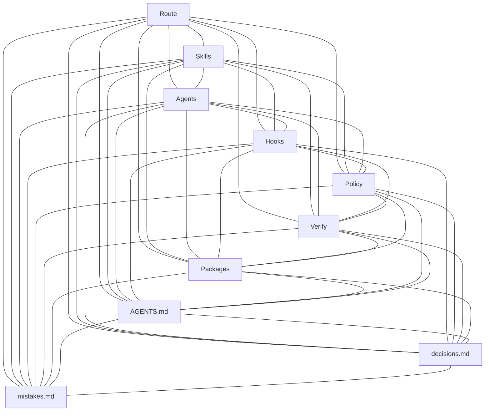

# Adaptive Grok Build Pro v2.0.11

A commercial-grade product for **Grok Build** — free of charge, public, and MIT-licensed.

## Current state

- Published identity remains **2.0.11** (`VERSION`, README H1, GitHub Release `v2.0.11`). This branch contains unreleased trust-boundary hardening.
- Standing contract: [AGENTS.md](AGENTS.md) — agent self-learning, bounded task splitting, one write owner, immutable control plane, protected pull-request delivery, and human-owned release.
- Local feedback: `python3 scripts/grok_verify.py --mode pr`.
- Independent gate: [`.github/workflows/trusted-ci.yml`](.github/workflows/trusted-ci.yml) runs strict verification on the exact pull-request SHA with Python 3.10 and 3.12, then builds the package.
- Release gate: [`.github/workflows/release.yml`](.github/workflows/release.yml) targets the protected `production` Environment and publishes only the exact verified `main` SHA.
- [docs/TRUST-BOUNDARY.md](docs/TRUST-BOUNDARY.md) defines a workable solo owner mode and a stronger split identity mode; GitHub's review settings differ because an author cannot approve their own pull request or an Environment run when self-review prevention applies.
- The workflows become authoritative only after the selected settings in [docs/TRUST-BOUNDARY.md](docs/TRUST-BOUNDARY.md) are enabled.
- Do not add `pyproject.toml`, `requirements.txt`, or `setup.py`; those files change repository detection and test-runner selection.

## Read first

1. [AGENTS.md](AGENTS.md)
2. [docs/TRUST-BOUNDARY.md](docs/TRUST-BOUNDARY.md)
3. [decisions.md](decisions.md)
4. [mistakes.md](mistakes.md)
5. [CHANGELOG.md](CHANGELOG.md)
6. [QUICKSTART.md](QUICKSTART.md)
7. `.grok-stack/runtime/active-route.json` for the live local route
8. This README's stack graph and map

## How work runs

The local loop is route → durable change package → one write owner → verification → independent reviews → `ready`. Delivery then leaves the agent trust domain: feature branch → pull request → exact-SHA `trusted-ci` → configured human gate → protected merge into `main`.

In solo owner mode, the owner inspects and manually merges after green checks; required approving reviews remain zero because the same GitHub account authored the pull request. In split identity mode, a separate bot or collaborator authors the pull request and a human CODEOWNER approves it. Release follows the matching Environment mode: owner dispatch and owner approval with self-review prevention disabled for solo operation, or separate dispatch plus owner approval with self-review prevention enabled for stronger separation.

`scripts/grok_approve.py` records a request only. It never grants permission to push, merge, dispatch workflows, edit the control plane, mutate external systems, or publish.

## Map

- [AGENTS.md](AGENTS.md)
- [docs/TRUST-BOUNDARY.md](docs/TRUST-BOUNDARY.md)
- [.github/CODEOWNERS](.github/CODEOWNERS)
- [.github/workflows/trusted-ci.yml](.github/workflows/trusted-ci.yml)
- [.github/workflows/release.yml](.github/workflows/release.yml)
- [decisions.md](decisions.md)
- [mistakes.md](mistakes.md)
- [CHANGELOG.md](CHANGELOG.md)
- [QUICKSTART.md](QUICKSTART.md)
- [VERSION](VERSION)
- [`.grok/skills/`](.grok/skills/)
- [`.grok/agents/`](.grok/agents/)
- [`.grok/hooks/`](.grok/hooks/)
- [`scripts/grok_route.py`](scripts/grok_route.py)
- [`scripts/grok_change.py`](scripts/grok_change.py)
- [`scripts/grok_verify.py`](scripts/grok_verify.py)
- [`scripts/grok_review.py`](scripts/grok_review.py)
- [`scripts/grok_approve.py`](scripts/grok_approve.py)
- [`scripts/grok_deploy.py`](scripts/grok_deploy.py)
- [`scripts/grok_doctor.py`](scripts/grok_doctor.py)
- [`scripts/install_into.py`](scripts/install_into.py)
- [`engineering/runbooks/`](engineering/runbooks/)
- [`packages/`](packages/)
- [`examples/bitrix-module/`](examples/bitrix-module/)
- [LICENSE](LICENSE)

## What this is

- Deterministic task routing and domain skills for Bitrix, API and events, data, frontend, security, incidents, AI, and integrations
- Quality profiles and durable change packages under `engineering/changes/`
- Fingerprint-bound verification and review receipts via `scripts/grok_*.py`
- One write owner with read-only analysis and review agents
- A local fail-open hook layer for recoverability, backed by an external pull-request and Environment trust boundary
- Self-learning through root `decisions.md` and `mistakes.md`

## Stack graph

Simple complete graph: every core piece is linked to every other.



| Node | Role |
| --- | --- |
| Route | `scripts/grok_route.py` and the active route |
| Skills | `.grok/skills/` and `.agents/skills/` |
| Agents | `.grok/agents/` |
| Hooks | `.grok/hooks/` |
| Policy | `.grok-stack/adaptive_grok/policy.py` |
| Verify | `scripts/grok_verify.py`, strict CI, and receipts |
| Packages | `packages/` and `scripts/package_stack.py` |
| Contract | `AGENTS.md` |
| Decisions | root `decisions.md` |
| Mistakes | root `mistakes.md` |

## Requirements

Local toolchain policy is minimum-or-newer. `built` is the version used for the published 2.0.11 tree; authoritative CI installs its own exact Ruff, Bandit, and Coverage.py versions.

| Tool | Minimum | Built | Fallback | Required |
| --- | --- | --- | --- | --- |
| Python 3 | 3.10 | 3.12.3 | 3.12 | yes |
| Git | 2.34 | 2.43.0 | 2.43 | yes |
| Grok Build CLI | 1.0.0 | 1.0.4 | 1.0.4 | for the TUI |
| GitHub CLI (`gh`) | 2.40 | 2.86.0 | 2.86 | for human workflow dispatch and release inspection |
| Node.js | 18 | 24.19.0 | 20 LTS | frontend profiles |
| npm | 9 | 11.17.0 | 10 | frontend profiles |
| PHP | 8.1 | 8.2 | 8.2 | PHP and Bitrix profiles |
| Composer | 2.2 | 2.7 | 2.7 | PHP and Bitrix profiles |

```bash
python3 scripts/grok_doctor.py --offer-install
```

Machine-readable pins: `.grok-stack/config/toolchain.json`.

## Install into a project

Install the local routing, agents, hooks, verification, and governance stack:

```bash
python3 scripts/install_into.py /path/to/your/repo
# skip host installs: --no-deps
# also install optional PHP, Node, and gh tools: --all-deps
```

Trusted GitHub CI and protected release files are opt-in and require the actual target repository owner:

```bash
python3 scripts/install_into.py /path/to/your/repo \
  --with-ci \
  --codeowner @user

# organization team:
# --codeowner @org/team
```

The installer renders the supplied identity into the target `.github/CODEOWNERS` and `docs/TRUST-BOUNDARY.md`, performs conflict detection against the rendered content, and never exports `@Dimkox` as the owner of another repository. GitHub branch rules and the `production` Environment still require manual configuration after installation.

Manual copy layout:

```text
.grok/            → project .grok/
.agents/skills/   → project .agents/skills/
.grok-stack/      → project .grok-stack/
scripts/          → project scripts/
AGENTS.md         → project AGENTS.md
decisions.md      → project decisions.md
mistakes.md       → project mistakes.md
engineering/      → project engineering/
```

Then:

```bash
cd /path/to/your/repo
grok inspect
grok
```

Invoke `/adaptive-delivery` or describe a development task; the router selects the relevant skills and agents.

## Scripts

Local loop: route → change → verify → independent reviews → `ready`. `grok_deploy` validates local evidence and prints the strict verification plus protected release-workflow dispatch for a human operator.

| Script | Role |
| --- | --- |
| `scripts/grok_route.py` | Classify and show the route |
| `scripts/grok_change.py` | Manage durable change packages |
| `scripts/grok_status.py` | Show runtime status |
| `scripts/grok_verify.py` | Run verification; `--strict` fails if authoritative Python tools are unavailable |
| `scripts/grok_review.py` | Record a fingerprint-bound independent review receipt |
| `scripts/grok_approve.py` | Record a non-authorizing human-action request |
| `scripts/grok_deploy.py` | Validate evidence and print the protected release workflow dispatch |
| `scripts/grok_doctor.py` | Check toolchain and structure health |
| `scripts/install_into.py` | Install the stack; `--with-ci` requires a target-specific `--codeowner` |

## Hooks and trust boundary

Lifecycle adapters live in `.grok/hooks/` and are registered in `.grok/hooks.json` and `.grok/hooks/adaptive.json`. Hooks classify prompts, protect secrets and Bitrix core, deny control-plane writes, and block real side-effect invocations while policy is healthy.

Hooks retain fail-open recovery behavior so a broken local import cannot freeze Grok. They are not the independent security boundary. Required GitHub checks, the configured human merge gate, CODEOWNERS in split identity mode, protected `main`, and the `production` Environment provide that boundary. See [docs/TRUST-BOUNDARY.md](docs/TRUST-BOUNDARY.md).

## Package

```bash
python3 scripts/package_stack.py
```

Default output is `dist/adaptive-grok-build-pro-v<VERSION>.zip` plus its SHA-256 file. Published copies live under `packages/` and on GitHub Releases. Runtime state, `.env` files, and private-key material are excluded.

## Bitrix

See `.grok/skills/bitrix-development/` and `examples/bitrix-module/`.

## License

**MIT.** A commercial product that is free of charge: use, copy, modify, and ship it. The repository is public. No EULA, no paid tier. Local checks are `make doctor`, `make verify`, and non-strict `grok_verify`. Authoritative CI runs `python3 scripts/grok_verify.py --mode pr --strict --json`; Semgrep, Trivy, and npm format checks remain signal-driven for consumer repositories.
