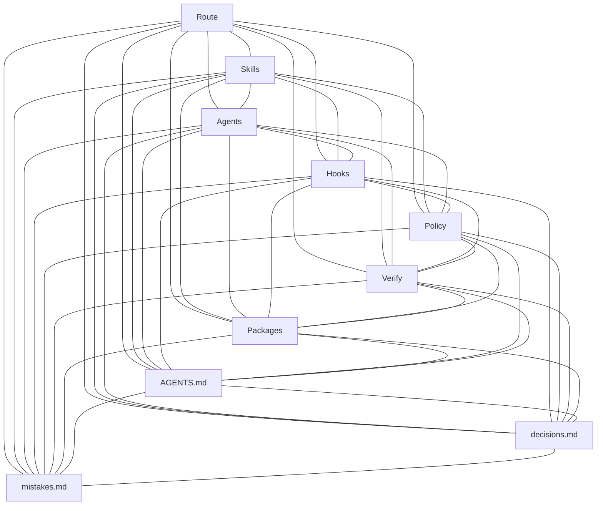

# Adaptive Grok Build Pro v2.0.8

A commercial-grade product for **Grok Build** — free of charge, public, and MIT-licensed.

## Current state

- Identity: **2.0.8** (`VERSION`, README H1). GitHub Release Latest may still be an older tag until a human last mile creates `v2.0.8`.
- Standing contract: [AGENTS.md](AGENTS.md) — first section is agent self-learning into [decisions.md](decisions.md) / [mistakes.md](mistakes.md); next is README-before-push.
- Quality gate: local `python3 scripts/grok_verify.py --mode pr` only. **No GitHub Actions.**
- Do not add `pyproject.toml` / `requirements.txt` / `setup.py` (flips repo detect).

## Read first

1. [AGENTS.md](AGENTS.md)
2. [decisions.md](decisions.md)
3. [mistakes.md](mistakes.md)
4. [CHANGELOG.md](CHANGELOG.md)
5. [QUICKSTART.md](QUICKSTART.md)
6. `.grok-stack/runtime/active-route.json` (live route; not product identity)
7. This README’s stack graph and map

## How work runs

Source-of-truth order is in AGENTS.md. Loop: route → change package → one write owner → `grok_verify --mode pr` → independent reviews → `ready` → `python3 scripts/grok_deploy.py` prints; humans run tag/push/release. Refresh this README before that push.

## Map

- [AGENTS.md](AGENTS.md)
- [decisions.md](decisions.md)
- [mistakes.md](mistakes.md)
- [CHANGELOG.md](CHANGELOG.md)
- [QUICKSTART.md](QUICKSTART.md)
- [VERSION](VERSION)
- [`.grok/skills/`](.grok/skills/)
- [`.grok/agents/`](.grok/agents/)
- [`.grok/hooks/`](.grok/hooks/)
- [`scripts/grok_route.py`](scripts/grok_route.py)
- [`scripts/grok_change.py`](scripts/grok_change.py)
- [`scripts/grok_verify.py`](scripts/grok_verify.py)
- [`scripts/grok_review.py`](scripts/grok_review.py)
- [`scripts/grok_approve.py`](scripts/grok_approve.py)
- [`scripts/grok_deploy.py`](scripts/grok_deploy.py)
- [`scripts/grok_doctor.py`](scripts/grok_doctor.py)
- [`scripts/install_into.py`](scripts/install_into.py)
- [`engineering/runbooks/`](engineering/runbooks/)
- [`packages/`](packages/)
- [`examples/bitrix-module/`](examples/bitrix-module/)
- [LICENSE](LICENSE)

## What this is

- Task routing + domain skills (Bitrix, API/events, data, frontend, security, incidents, …)
- Quality profiles and change packages under `engineering/changes/`
- Verification / review receipts via `scripts/grok_*.py`
- Multi-agent discipline described in `AGENTS.md`
- `AGENTS.md` starts with the self-learning rule and writes to `decisions.md` / `mistakes.md`

## Stack graph

Simple complete graph: every core piece is linked to every other.



| Node | Role |
| --- | --- |
| Route | `scripts/grok_route.py` / active-route |
| Skills | `.grok/skills/` and `.agents/skills/` |
| Agents | `.grok/agents/` |
| Hooks | `.grok/hooks/` |
| Policy | `.grok-stack/adaptive_grok/policy.py` |
| Verify | `scripts/grok_verify.py` + receipts |
| Packages | `packages/` + `scripts/package_stack.py` |
| Contract | `AGENTS.md` first rule: log to `decisions.md` / `mistakes.md` |
| Decisions | root `decisions.md` |
| Mistakes | root `mistakes.md` |

## Requirements

Pins are **minimum or newer**. `built` is the version this tree was verified on. If a tool is missing or older than minimum, `python3 scripts/grok_doctor.py` prints an **install offer** for the fallback (or install a newer version).

| Tool | Minimum | Built | Fallback | Required |
| --- | --- | --- | --- | --- |
| Python 3 | 3.10 | 3.12.3 | 3.12 | yes |
| Git | 2.34 | 2.43.0 | 2.43 | yes |
| Grok Build CLI | 1.0.0 | 1.0.4 | 1.0.4 | for the TUI |
| GitHub CLI (`gh`) | 2.40 | 2.86.0 | 2.86 | for GitHub Release |
| Node.js | 18 | 24.19.0 | 20 LTS | frontend profiles |
| npm | 9 | 11.17.0 | 10 | frontend profiles |
| PHP | 8.1 | 8.2 | 8.2 | PHP/Bitrix profiles |
| Composer | 2.2 | 2.7 | 2.7 | PHP/Bitrix profiles |

```bash
python3 scripts/grok_doctor.py --offer-install
```

Machine-readable pins: `.grok-stack/config/toolchain.json`.

## Install into a project

```bash
# from this package root — copies the stack and installs missing required tools
python3 scripts/install_into.py /path/to/your/repo
# skip host installs: --no-deps
# also PHP/Node/gh: --all-deps
```

Or copy manually:

```text
.grok/            → project .grok/          (config, hooks, agents, skills)
.agents/skills/   → project .agents/skills/
.grok-stack/      → project .grok-stack/
scripts/          → project scripts/
AGENTS.md         → project AGENTS.md
decisions.md      → project decisions.md
mistakes.md       → project mistakes.md
engineering/      → project engineering/  (if empty scaffold needed)
```

Then in the project:

```bash
cd /path/to/your/repo
grok inspect    # should see skills + AGENTS.md
grok            # start TUI
```

Invoke the main controller skill:

```text
/adaptive-delivery
```

or just describe a development task — Grok should pick up skills from `.grok/skills/`.

## Scripts

Loop: route → change → verify → independent reviews → `ready` → `python3 scripts/grok_deploy.py` (prepare-only) → humans run the printed tag / push / GitHub Release commands.

| Script | Role |
|--------|------|
| `scripts/grok_route.py` | Classify / show route |
| `scripts/grok_change.py` | Start durable change package |
| `scripts/grok_status.py` | Runtime status |
| `scripts/grok_verify.py` | Verification gate (unittest, Ruff, Bandit, measured coverage in `pr`/`release`) |
| `scripts/grok_review.py` | Record review receipt |
| `scripts/grok_approve.py` | Short-lived explicit approval (production / external-write / protected-path) |
| `scripts/grok_deploy.py` | Prepare-only last mile: check evidence, print human publish commands |
| `scripts/grok_doctor.py` | Health check |
| `scripts/install_into.py` | Install stack into target repo |

## Hooks

Lifecycle adapters live in `.grok/hooks/` and are registered in both:

- `.grok/hooks.json` — doctor/structure contract (`command` + `commandWindows`)
- `.grok/hooks/adaptive.json` — Grok project-hook discovery

Trust the folder once (`/hooks-trust` or `grok --trust`). Hooks classify prompts and enforce policy (secrets, Bitrix core, destructive commands, and real side-effect invocations such as `git push`). Missing evidence is a Stop warning, not a hard block. Production policy matches command invocations, not words inside paths or arguments.

## Package

```bash
python3 scripts/package_stack.py
```

Default output is `dist/adaptive-grok-build-pro-v<VERSION>.zip` (gitignored scratch).
Published copies live in `packages/` and on the GitHub Release. Zip members use the prefix `adaptive-grok-build-pro/`.

## Bitrix

See skills under `.grok/skills/bitrix-development/` and example module in `examples/bitrix-module/`.

## License

**MIT.** A commercial product that is free of charge: use, copy, modify, and ship it. The repository is public. No EULA, no paid tier. Local checks: `make doctor` / `make verify`. `grok_verify --mode pr` also runs Ruff and Bandit when those CLIs are on PATH (skip if missing) and a Coverage.py fail-under of 74. Semgrep, Trivy config, and npm prettier/format run only on consumer trees that have those signals.
