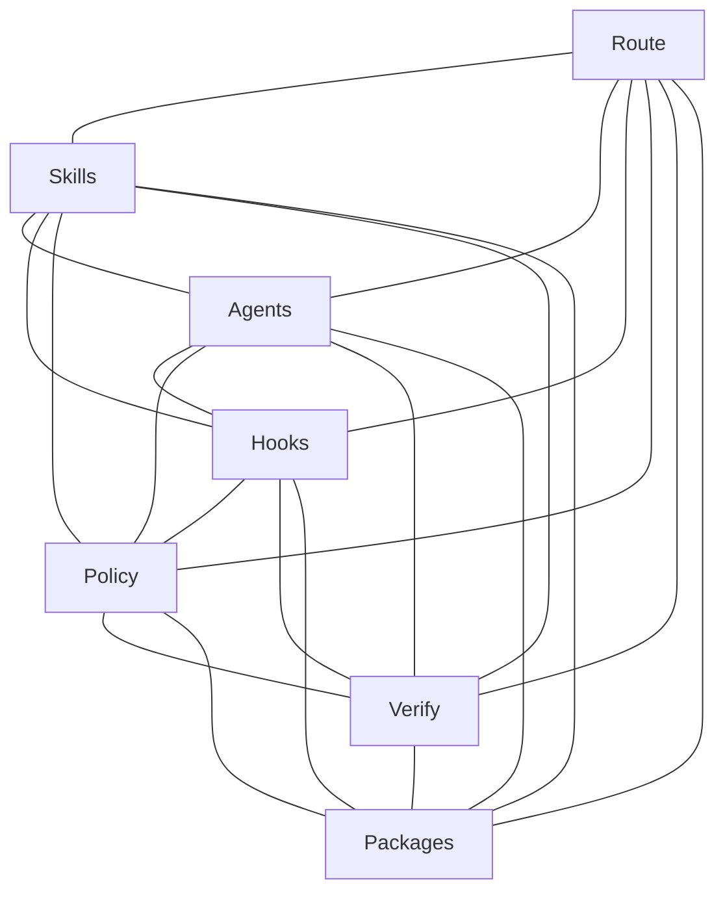

# Adaptive Grok Build Pro v2.0.4

A commercial-grade product for **Grok Build** — free of charge, public, and MIT-licensed.

## What this is

- Task routing + domain skills (Bitrix, API/events, data, frontend, security, incidents, …)
- Quality profiles and change packages under `engineering/changes/`
- Verification / review receipts via `scripts/grok_*.py`
- Multi-agent discipline described in `AGENTS.md`

## Stack graph

Simple complete graph: every core piece is linked to every other.



| Node | Role |
| --- | --- |
| Route | `scripts/grok_route.py` / active-route |
| Skills | `.grok/skills/` and `.agents/skills/` |
| Agents | `.grok/agents/` |
| Hooks | `.grok/hooks/` |
| Policy | `.grok-stack/adaptive_grok/policy.py` |
| Verify | `scripts/grok_verify.py` + receipts |
| Packages | `packages/` + `scripts/package_stack.py` |

## Requirements

- [Grok Build CLI](https://x.ai/build) (`grok`) installed and authenticated (SuperGrok / X Premium+)
- Python 3.10+
- Git

## Install into a project

```bash
# from this package root
python3 scripts/install_into.py /path/to/your/repo
```

Or copy manually:

```text
.grok/            → project .grok/          (config, hooks, agents, skills)
.agents/skills/   → project .agents/skills/
.grok-stack/      → project .grok-stack/
scripts/          → project scripts/
AGENTS.md         → project AGENTS.md
engineering/      → project engineering/  (if empty scaffold needed)
```

Then in the project:

```bash
cd /path/to/your/repo
grok inspect    # should see skills + AGENTS.md
grok            # start TUI
```

Invoke the main controller skill:

```text
/adaptive-delivery
```

or just describe a development task — Grok should pick up skills from `.grok/skills/`.

## Scripts

Loop: route → change → verify → independent reviews → `ready` → `python3 scripts/grok_deploy.py` (prepare-only) → humans run the printed tag / push / GitHub Release commands.

| Script | Role |
|--------|------|
| `scripts/grok_route.py` | Classify / show route |
| `scripts/grok_change.py` | Start durable change package |
| `scripts/grok_status.py` | Runtime status |
| `scripts/grok_verify.py` | Verification gate |
| `scripts/grok_review.py` | Record review receipt |
| `scripts/grok_approve.py` | Short-lived explicit approval (production / external-write / protected-path) |
| `scripts/grok_deploy.py` | Prepare-only last mile: check evidence, print human publish commands |
| `scripts/grok_doctor.py` | Health check |
| `scripts/install_into.py` | Install stack into target repo |

## Hooks

Lifecycle adapters live in `.grok/hooks/` and are registered in both:

- `.grok/hooks.json` — doctor/structure contract (`command` + `commandWindows`)
- `.grok/hooks/adaptive.json` — Grok project-hook discovery

Trust the folder once (`/hooks-trust` or `grok --trust`). Hooks classify prompts and enforce policy (secrets, Bitrix core, destructive commands, and real side-effect invocations such as `git push`). Missing evidence is a Stop warning, not a hard block. Production policy matches command invocations, not words inside paths or arguments.

## Package

```bash
python3 scripts/package_stack.py
```

Default output is `dist/adaptive-grok-build-pro-v<VERSION>.zip` (gitignored scratch).
Published copies live in `packages/` and on the GitHub Release. Zip members use the prefix `adaptive-grok-build-pro/`.

## Bitrix

See skills under `.grok/skills/bitrix-development/` and example module in `examples/bitrix-module/`.

## License

**MIT.** A commercial product that is free of charge: use, copy, modify, and ship it. The repository is public. No EULA, no paid tier. Local checks: `make doctor` / `make verify`.
