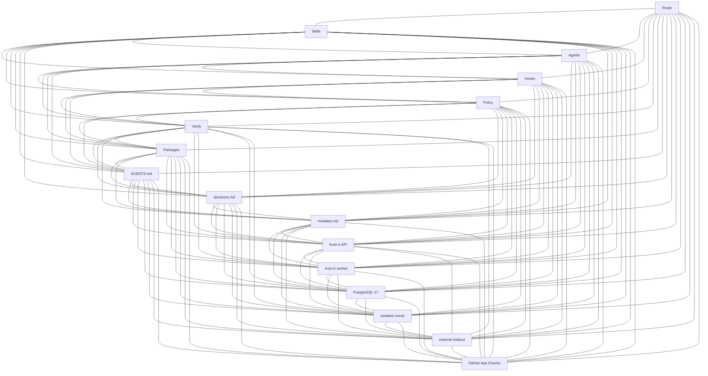

# Analysis — architect resume (K16 docs + next Trust CI slice)

Change: `20260823-p0-trust-ci-control-plane-postgresql-integration-f771ec`  
Active route: `56da62035c35` · write=`general_implementer` · reviews=`code_reviewer`+`test_reviewer`  
HEAD: `5915b56db7d6aedcd52a6c023418db84d45dd98f` on `feat/trust-ci-control-plane`  
Human gates on this route: none. Record this design and continue. Do not reopen product design.

Read-only. No product-file edits from this agent. No `.env`, keys, push, merge, deploy, GitHub App, or image push.

Narrow question: bounded design to finish the crashed K16 README graph and stale `trust-ci/README.md` compose commands, then the next coherent Trust CI activation slice that does not require undeclared production writes.

---

## Ruling (one screen)

**Finish the in-tree docs first. Do not start image pin, GitHub App, or deploy in the same slice.**

The crash in `evidence/implementation-readme.md` is not a design disagreement. Tests, toolchain, QUICKSTART, and the rollout runbook already expect K16 + two-file compose. `README.md`, `trust-ci/README.md`, and `decisions.md` were denied because grant `6fcd3898df7b0eae` was bound to route `2335b3d0d9fc` and fingerprint `aa731cb…`. The first protected batch mutated the tree; those three files never landed. Current route is `56da62035c35`. The old grant cannot be reused.

| Confirm | Rule |
| --- | --- |
| First mermaid | **One** K16 clique. Exact IDs below. Edges from `itertools.combinations`, 120 `---` lines, no `-->`, no duplicates. |
| Caption | Must **stop** saying Trust CI is outside the graph. |
| Node-role table | Keep the ten local-workflow rows; **add the six Trust CI nodes**. |
| `VERSION` | **2.0.11**. Do not bump. Do not retag. Do not rebuild the zip. |
| `trust-ci/README.md` | Two-file merge build; inspect `$TRUST_CI_*_IMAGE`; `--exit-code-from postgres-integration` or `make trust-ci-postgres-test`. |
| Digests | Do **not** invent image digests. Leave `REPLACE_WITH_*` in examples. |
| Toolchain | Do **not** add `grype`. Do **not** add a standalone `docker-compose` tool id. |
| Root compose | Do **not** add root `docker-compose.yml` / `Dockerfile` (would emit `trivy-config` and break `test_this_repo_shaped_tree_omits_bucket_b`). |
| Dual-graph alternative | **Rejected.** No second mermaid. No `PolicyEpoch` / `BranchProtect` vertices. |

After those three files are green: images/holdout pin is the next **handoff** step, but building-for-pin, pushing, GitHub App creation, and deploy are operational. See §5.

---

## 0. Crash location (do not rediscover)

Working tree at HEAD `5915b56` already contains:

| Landed (dirty) | Not landed (still stale) |
| --- | --- |
| `tests/test_structure.py` `test_readme_stack_graph_is_complete` — 16 IDs, `len(edge_lines) == C(16,2)` | `README.md` first fence still **K10 / 45 edges**; caption still says Trust CI is outside |
| `tests/test_toolchain.py` asserts `docker` `syft` `trivy` `cosign` all `required: false` | `trust-ci/README.md` still `docker compose --profile build build` on `compose.yaml` alone; inspects `adaptive-trust-ci-api:2.1.0`; `--exit-code-from tests` |
| `.grok-stack/config/toolchain.json` those four optional ids | `decisions.md` still only the 2026-08-16 **K10 / 45** ruling |
| `QUICKSTART.md` operator sections + correct compose | |
| `engineering/runbooks/trust-ci-rollout.md` two-file merge + inspect `$TRUST_CI_*_IMAGE` | |

Do **not** re-edit the landed files unless a focused test fails. Do **not** commit `engineering/changes/20260817-user-query-вычисти-*`.

Protected-path writes still required for:

```text
README.md
trust-ci/README.md
decisions.md
```

Mint a **new** grant for **this** route and **current** dirty-tree fingerprint. The previous grant is stale on route, HEAD, and fingerprint.

---

## 1. README — single K16 clique

Keep `graph TD`. Keep the three labeled local-contract vertices. Add six labeled Trust CI vertices. Emit **exactly** the 120 edges below, in this order, copied from `itertools.combinations` on the locked ID list. Do not add a second fence. Do not use `-->`.

### 1.1 Exact vertex IDs (case-sensitive; same list as the test)

```text
Route
Skills
Agents
Hooks
Policy
Verify
Packages
Contract
Decisions
Mistakes
TrustAPI
TrustWorker
Postgres
Runner
Holdout
GitHubApp
```

### 1.2 Labels (IDs stay; labels are display-only)

```text
Contract["AGENTS.md"]
Decisions["decisions.md"]
Mistakes["mistakes.md"]
TrustAPI["trust-ci API"]
TrustWorker["trust-ci worker"]
Postgres["PostgreSQL 17"]
Runner["isolated runner"]
Holdout["external holdout"]
GitHubApp["GitHub App Checks"]
```

`migrate` and `runner-loader` share API/worker images — footnote in the node-role table, **not** vertices. Rootless DinD is an edge of Runner, not a 17th node (`C(17,2)=136` would fail the test).

### 1.3 Caption (replace the two sentences at `README.md` “Stack graph”)

Current stale caption:

> Simple complete graph: every core local-workflow piece is linked to every other. The external Trust CI boundary is deliberately outside this prompt-controlled graph.

Replace with (or equivalent; **must not** say Trust CI is outside):

> Simple complete graph: every listed core node is linked to every other with a `---` edge. The listed set is the local Grok workflow plus the independently deployed Trust CI applications and PostgreSQL. Prompts, local receipts and delegated grants are not merge authority.

### 1.4 First mermaid fence (copy as-is)



That is `C(16,2)=120` unique undirected pairs. Keep every pair **inside** the fence. A pair that exists only in prose can satisfy the missing-pair loop and still fail `len(edge_lines) == 120`, or pass-with-a-lie if extras exist outside the fence.

H1 stays `# Adaptive Grok Build Pro v2.0.11`. Current-state identity stays **2.0.11**. Naming Trust CI service identity `2.1.0` in Current state is allowed; do not collapse it into the product VERSION.

### 1.5 Node-role table — add six rows

Keep the existing ten rows. Append:

| Node | Role |
| --- | --- |
| TrustAPI | `trust-ci/` FastAPI image; HMAC webhook intake; no GitHub App key |
| TrustWorker | `trust-ci/` worker; claims PostgreSQL leases; publishes the Check Run |
| Postgres | Durable PostgreSQL 17 (`TRUST_CI_POSTGRES_IMAGE`); jobs, leases, approvals, attestations |
| Runner | Isolated no-network runner container; `policy.sandbox.image` must equal `TRUST_CI_RUNNER_IMAGE` |
| Holdout | External digest-pinned bundle, outside the PR checkout |
| GitHubApp | App-owned Checks `adaptive-trust-ci/verified@<policy-sha12>` bound to the App ID |

Footnote (one line under the table, not a vertex): oneshots `migrate` / `runner-loader` reuse API/worker images; privileged rootless DinD is an execution edge of Runner.

---

## 2. `trust-ci/README.md` — two-file merge, no invented tags

Production `compose.yaml` has **no** `build:` keys. `compose.build.yaml` adds them. Only `runner-image` sets a local tag (`TRUST_CI_RUNNER_BUILD_TAG` default `adaptive-trust-ci-runner:2.1.0`). API/worker images are **not** tagged `adaptive-trust-ci-api:2.1.0`.

Copy the already-corrected QUICKSTART/runbook commands. Do not fork a third dialect.

### 2.1 Bootstrap “Build and pin the images” (today lines 89–94)

Replace:

```bash
docker compose --profile build build api worker runner-image
docker image inspect adaptive-trust-ci-api:2.1.0 --format '{{.Id}}'
docker image inspect adaptive-trust-ci-worker:2.1.0 --format '{{.Id}}'
docker image inspect adaptive-trust-ci-runner:2.1.0 --format '{{.Id}}'
```

with (this section already `cd trust-ci`):

```bash
docker compose -f compose.yaml -f compose.build.yaml --profile build build api worker runner-image
docker image inspect "$TRUST_CI_API_IMAGE" --format '{{.Id}} {{index .RepoDigests 0}}'
docker image inspect "$TRUST_CI_WORKER_IMAGE" --format '{{.Id}} {{index .RepoDigests 0}}'
docker image inspect "$TRUST_CI_RUNNER_IMAGE" --format '{{.Id}} {{index .RepoDigests 0}}'
```

One prose line: inspect `$TRUST_CI_*_IMAGE`; do not inspect `adaptive-trust-ci-api:2.1.0`. Put measured `name@sha256:` values into **untracked** deploy env and host `runtime/policy.json`. Rebuilding runner/policy/holdout changes the policy epoch. Do not paste a hex digest into git.

### 2.2 Verification (today lines 260–266; “From the repository root”)

Replace:

```bash
docker compose -f trust-ci/compose.test.yaml up --build --abort-on-container-exit --exit-code-from tests
docker compose -f trust-ci/compose.yaml config
docker compose -f trust-ci/compose.yaml build api worker
docker compose -f trust-ci/compose.yaml --profile build build runner-image
```

with:

```bash
make trust-ci-postgres-test
# or: docker compose -f trust-ci/compose.test.yaml up --build --abort-on-container-exit --exit-code-from postgres-integration
docker compose -f trust-ci/compose.yaml -f trust-ci/compose.build.yaml --profile build build api worker runner-image
docker compose -f trust-ci/compose.yaml config
```

`Makefile` `trust-ci-postgres-test` already exits from `postgres-integration` and traps `down -v`. `trust-ci-compose` remains config-only against production compose. `docker-compose-build-config` already merges both files.

Do not leave `compose.yaml build api worker`. That file cannot build.

---

## 3. `decisions.md` — one ≤3-sentence K16 ruling

Insert **after** the `# Decisions` intro, **before** the draft-PR entry. Do **not** delete the historical 2026-08-16 K10 entry (same rule as CHANGELOG 2.0.8).

```markdown
## 2026-08-23 — README stack graph is K16 including Trust CI

Trust CI API, worker, PostgreSQL, runner, holdout and GitHub App are now listed core nodes, so the first mermaid is one K16 clique of 120 undirected `---` edges generated from `itertools.combinations`. A missing pair is a stale map; Trust CI is no longer outside the graph. Prompts and local receipts remain not merge authority.
```

Three sentences. No fourth.

---

## 4. Explicit non-goals for this docs pass

- Do not bump `VERSION`, `.grok-stack/adaptive_grok/__init__.py`, CHANGELOG identity, or `packages/*.zip`.
- Do not add `grype` to `toolchain.json` or tests. Trivy is the vuln scanner. QUICKSTART may keep “grype is not a product pin”; do not add a grype install stanza.
- Do not add root `docker-compose.yml`, `docker-compose.yaml`, `Dockerfile`, or `Containerfile`.
- Do not add a second mermaid fence or extra `---` lines in prose.
- Do not rewrite `trust-ci/.env.example` placeholders into invented digests.
- Do not create/install a GitHub App, register a webhook, `docker compose up` the production topology, `docker push`, or `supply-chain-release.sh --confirm-push`.
- Do not read `trust-ci/runtime/*` keys, `.env`, or `github-app-private-key.pem`.
- Do not `git push origin main`. Delivery remains PR-only on `feat/trust-ci-control-plane`.
- Do not spawn any agent outside `allowed_agents`. Write owner is `general_implementer` only.

---

## 5. Next coherent Trust CI activation slice (after docs pass)

Handoff order still stands: §3 build-and-pin → §4 GitHub App → §5 deploy → §6 webhook proof → §7 approvals → §8 branch-protect → §9 update draft `#2`. **This resume does not advance past docs until those three files and verify are green.**

### 5.1 Finish in-tree docs first

Write owner applies §1–§3, then:

```bash
python3 -m unittest tests.test_structure.StructureTests.test_readme_stack_graph_is_complete \
  tests.test_structure.StructureTests.test_version_identity_matches_readme \
  tests.test_toolchain.ToolchainTests.test_real_toolchain_json_required_and_optional_sets -q
python3 scripts/grok_verify.py --mode pr
```

Then `code_reviewer` and `test_reviewer` on the **same** tree. Local receipts are preflight, not merge authority.

### 5.2 Is local docker build-without-push in scope or blocked?

**Out of the docs slice. After docs: smoke-only, not the pin. Registry push / App / deploy remain blocked.**

Facts:

- `policy.py` `_production_action` gates `docker push`, not `docker compose … build`. Local two-file build is not a named production action.
- `compose.build.yaml` requires `TRUST_CI_PYTHON_BASE_IMAGE` as `name@sha256:<64 hex>`. `.env.example` still has `REPLACE_WITH_BASE_DIGEST`. Inventing that hex is forbidden.
- `docker image inspect "$TRUST_CI_*_IMAGE"` `RepoDigests` is empty until a registry push/load. Local image **Id** is not a deployable `name@sha256:` pin. `policy.example.json` runner digest must stay `REPLACE_WITH_IMMUTABLE_RUNNER_DIGEST`.
- `docker compose up -d postgres migrate api worker` is deploy. `supply-chain-release.sh --confirm-push` is a push. GitHub App creation writes credentials the agent must not handle.

| Action | After docs? |
| --- | --- |
| In-tree K16 + README compose corrections | **In scope now** (this slice) |
| Measure a real `python:3.12-slim-bookworm` digest from the registry (not invented) and two-file `compose build` **without** `push` | **Conditionally in scope as a host smoke compile**, only if Docker Engine is present and the base digest is measured. Record image Ids in **evidence**, not as committed pins. |
| Write measured/local Ids into `policy.example.json` / `.env.example` / git | **Blocked** (would invent or freeze a non-registry digest) |
| `docker push` / `supply-chain-release.sh --confirm-push` | **Blocked** without exact `docker-push` (and resource) grant |
| Create/install GitHub App, webhook secret, App RSA key | **Blocked** without exact delegated external-write; secrets stay off git and off the agent |
| `docker compose up` production topology, TLS, backups, `branch-protect` | **Blocked** without exact deploy/protection grants |
| Merge `#2` | **Blocked**. Human-owned after the live App-owned check exists |

If Docker is missing, or the Python base digest cannot be measured without guessing, **report blocked** and stop. Do not skip ahead to GitHub App.

Handoff §3 (immutable pin of API/worker/runner/holdout into **deployed** policy) is therefore **not** completed by a local build-without-push. The next *operational* handoff step after a successful local smoke is still: registry pin + host policy, which requires grants this route does not currently hold.

---

## 6. Grants the write owner needs

`scripts/grok_approve.py` only materializes consent already in context. Architect does not mint grants.

Required for this docs slice:

```text
scope: protected-path
action: protected-path-write
resources: README.md, trust-ci/README.md, decisions.md
repository: Dimkox/adaptive-grok-build-pro
route_id: 56da62035c35
change_id: 20260823-p0-trust-ci-control-plane-postgresql-integration-f771ec
git_head: 5915b56db7d6aedcd52a6c023418db84d45dd98f
tree_fingerprint: <current dirty tree, including already-landed test/toolchain/QUICKSTART/runbook>
TTL: short
```

Do not reuse `6fcd3898df7b0eae` (wrong route `2335b3d0d9fc`, stale fingerprint). Do not use wildcard scope. Do not mint `docker-push`, `external-write`, or production deploy grants in this slice.

QUICKSTART is already updated and is not a protected path today. Makefile/runbook already teach the correct compose merge.

---

## 7. Residual risks (do not “fix” in this slice)

1. 120-edge mermaid is dense; that is the AGENTS.md completeness rule, not a defect to split into two graphs.
2. Product `2.0.11` vs Trust CI `2.1.0` remains an independent service identity.
3. Example policy runner digest is still `REPLACE_WITH_*`; documenting “pin on the host” is correct.
4. Draft PR `#2` still will not prove the live check until a non-draft webhook path exists; that is activation, not docs.
5. Privileged DinD, admin-token blast radius, and epoch-changing rollback remain as in `evidence/analysis-architect.md` §4.
6. Local receipts / this file / delegated grants are not the App-owned merge verdict.

---

## Return block (write owner)

1. Obtain a **new** protected-path grant for route `56da62035c35` covering `README.md`, `trust-ci/README.md`, `decisions.md` on HEAD `5915b56` + current dirty fingerprint.
2. Replace the first README mermaid with the K16 fence in §1.4; replace the caption; append the six node-role rows.
3. Patch `trust-ci/README.md` per §2.1 and §2.2.
4. Prepend the three-sentence K16 ruling in §3. Leave the old K10 entry in place.
5. Run the focused structure/toolchain tests, then `python3 scripts/grok_verify.py --mode pr`.
6. Stop. Do not build/push images, do not create a GitHub App, do not deploy. Report whether Docker is available for a later **build-without-push smoke** that still cannot pin.

Route `56da62035c35` analysis complete. Write owner is `general_implementer`.
