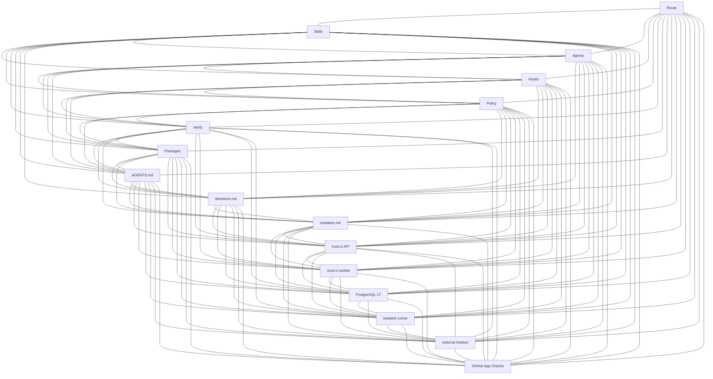

# Docs research resume — README / trust-ci README / decisions

Change: `engineering/changes/20260823-p0-trust-ci-control-plane-postgresql-integration-f771ec`  
Active route: `56da62035c35` (`docs_researcher` allowed; write-owner `general_implementer`)  
Agent: `docs_researcher` (read-only)  
Date: 2026-08-23

This report recovers exact replacement strings for the crashed README / `trust-ci/README.md` / `decisions.md` pass. It does **not** invent APIs, image digests, policy-epoch 12-hex, GitHub App IDs, or Check Run IDs.

Do not edit `.env`, keys, or credentials. Do not push, merge, or deploy. Do not use shell redirects/tee/python to mutate protected files.

## Crash to resume (not in `mistakes.md`)

Source: `engineering/changes/.../evidence/implementation-readme.md`.

Grant `6fcd3898df7b0eae` (`protected-path-write`, route `2335b3d0d9fc`, HEAD `5915b56db7d6aedcd52a6c023418db84d45dd98f`, fingerprint `aa731cb93c12…`) was valid at the start of that turn. The first successful protected batch (`tests/test_structure.py`, `tests/test_toolchain.py`, `.grok-stack/config/toolchain.json`) changed the working tree. Later `Write`/`Edit` of `README.md`, `trust-ci/README.md`, and `decisions.md` was denied:

```text
Hook denied: Protected path edit requires an exact delegated grant for README.md.
Hook denied: Protected path edit requires an exact delegated grant for trust-ci/README.md.
Hook denied: Protected path edit requires an exact delegated grant for decisions.md.
```

`AGENTS.md` Local delegated grants: any tree or commit change invalidates the grant. Closest `mistakes.md` pattern is **2026-08-14 — Bound verification to an intermediate tree** (a later write invalidates a fingerprint-bound artifact). There is **no** `mistakes.md` entry for “first protected mutation invalidates the rest of the batch.” Write owner should add one if they treat this crash as a real problem.

Operational implication: request a **new** `protected-path-write` grant bound to the **current** tree fingerprint, listing all three remaining resources. If the hook re-hashes after each successful write, expect a fresh grant after each file. Do not bypass with shell mutation (`test_control_plane_shell_mutation_is_blocked_even_with_path_grant`).

## Already landed (do not regress)

| File | Status |
| --- | --- |
| `tests/test_structure.py` `test_readme_stack_graph_is_complete` | 16 IDs; `len(edge_lines) == len(list(itertools.combinations(nodes, 2)))` = 120 |
| `tests/test_toolchain.py` | asserts `docker`, `syft`, `trivy`, `cosign` exist and `required is False` |
| `.grok-stack/config/toolchain.json` | grok `built`/`fallback` `1.0.5`; four optional tools appended |
| `QUICKSTART.md` | operator sections already patched (consumer 0–7 kept) |
| `engineering/runbooks/trust-ci-rollout.md` | compose/inspect/postgres-test already patched |
| `VERSION` | still `2.0.11` — do **not** bump for this docs pass |

`QUICKSTART.md` is **not** a protected path today. Do not rewrite it unless aligning a leftover (see drift flags). `engineering/runbooks/trust-ci-rollout.md` is not in `protected_paths`.

## AGENTS.md graph rule (must apply)

Quote (`AGENTS.md` § README before push):

> Before proposing a release, update `README.md` so it matches this tree: current VERSION, what exists, where it lives, and how the pieces connect.
>
> The README stack graph must stay complete: every listed core node is linked to every other with a `---` edge. A missing edge means the map is stale. Do not propose a release whose graph or current-state section is behind the tree.

`decisions.md` 2026-08-16 (K10 / 45 pairs) is **historical**. Do not rewrite it. Add a new ≤3-sentence entry for K16.

Identity lock: `test_version_identity_matches_readme` requires README H1 `# Adaptive Grok Build Pro v2.0.11`. Keep it.

## Test contract the README fence must satisfy

`tests/test_structure.py` `test_readme_stack_graph_is_complete` hardcodes this **ordered** ID list:

```python
nodes = [
    "Route", "Skills", "Agents", "Hooks", "Policy",
    "Verify", "Packages", "Contract", "Decisions", "Mistakes",
    "TrustAPI", "TrustWorker", "Postgres", "Runner", "Holdout", "GitHubApp",
]
```

Rules recovered from the test (do not invent others):

- Whole-README text must contain `Left --- Right` or `Right --- Left` for every unordered pair.
- First ` ```mermaid ` fence is parsed.
- Lines matching `\S+ --- \S+` must number exactly `C(16,2)=120`.
- A `-->` line is **not** counted → under-count fails.
- Duplicate `---` lines over-count and fail.
- Node-role table is **not** asserted; keep it in sync with listed IDs anyway (AGENTS.md current-state rule).
- Do not put a second complete graph in `QUICKSTART.md`.

Generate edges as `itertools.combinations(nodes, 2)` → `{left} --- {right}`.

---

## 1. `README.md` — exact replacements

### 1.1 Caption (stale)

**Find:**

```text
Simple complete graph: every core local-workflow piece is linked to every other. The external Trust CI boundary is deliberately outside this prompt-controlled graph.
```

**Replace with:**

```text
Simple complete graph: every listed core node is linked to every other. Local workflow plus independently deployed Trust CI applications and PostgreSQL; prompts, hooks and local receipts are still not merge authority.
```

### 1.2 First mermaid fence — replace the whole fence

**Find (current K10, 45 `---` lines):** the fence starting at ` ```mermaid ` under `## Stack graph` through the closing ` ``` `.

**Replace with** this exact fence (labels do not contain ` --- ` so they do not count; 120 edge lines do). Node IDs must match the test list character-for-character:

````markdown

````

Count check: Route 15 + Skills 14 + Agents 13 + Hooks 12 + Policy 11 + Verify 10 + Packages 9 + Contract 8 + Decisions 7 + Mistakes 6 + TrustAPI 5 + TrustWorker 4 + Postgres 3 + Runner 2 + Holdout 1 = 120. No `-->`. No duplicate pairs.

Oneshots `migrate` and `runner-loader` share API/worker images — footnotes in the node-role table, **not** extra vertices. Rootless DinD is an edge of Runner, not a 17th node (`C(17,2)=136` would fail the test).

### 1.3 Node-role table — append after `Mistakes`

**Find** the last table row:

```markdown
| Mistakes | root `mistakes.md` |
```

**Keep it, then append:**

```markdown
| TrustAPI | `trust-ci/` API image; FastAPI `127.0.0.1:8080`; no Docker, Git, or GitHub App key |
| TrustWorker | `trust-ci/` worker; claims jobs, holdout, sandbox, attestation, Checks API |
| Postgres | Durable PostgreSQL 17 (`TRUST_CI_POSTGRES_IMAGE`, volume `trust-ci-postgres`) |
| Runner | Isolated no-network runner (`TRUST_CI_RUNNER_IMAGE`) |
| Holdout | External holdout bundle outside the pull-request checkout |
| GitHubApp | GitHub App Checks API; `adaptive-trust-ci/verified@<policy-sha12>` |
```

Do not invent endpoints beyond those already in `trust-ci/README.md` (`/health/ready`, `/webhooks/github`, `/approvals`, `/jobs/*`, `/attestations/*`).

### 1.4 Requirements table vs `toolchain.json` — **drift after grok 1.0.5 and new optional tools**

No test asserts README rows equal `toolchain.json`. Drift is currently real.

Toolchain policy string: `"minimum_or_newer; built is the tested pin"`.

#### Grok row (must change)

**Find:**

```markdown
| Grok Build CLI | 1.0.0 | 1.0.4 | 1.0.4 | for the TUI |
```

**Replace with:**

```markdown
| Grok Build CLI | 1.0.0 | 1.0.5 | 1.0.5 | for the TUI |
```

Source: `.grok-stack/config/toolchain.json` id `grok`: `minimum` `1.0.0`, `built` `1.0.5`, `fallback` `1.0.5`, `required` true, `profile` `tui`.

#### New optional rows (append before the doctor command; all `required: false`)

Source: same file. **Do not add `grype`.** **Do not add standalone `docker-compose`.** **Do not add required `psql`.** Cosign has **no** `built` key (host did not have it); do not invent a built pin. Linux install pin is `v2.4.3` (install command only).

```markdown
| Docker Engine | 24.0 | 29.7.2 | 29 | no (Trust CI host) |
| Syft | 1.0 | 1.51.0 | 1.51 | no (supply-chain) |
| Trivy | 0.50 | 0.74.0 | 0.74 | no (supply-chain) |
| Cosign | 2.0 | — | 2.4 | no (supply-chain) |
```

Exact toolchain fields:

| id | name | required | profile | minimum | built | fallback |
| --- | --- | --- | --- | --- | --- | --- |
| docker | Docker Engine | false | trust-ci | 24.0 | 29.7.2 | 29 |
| syft | Syft | false | supply-chain | 1.0 | 1.51.0 | 1.51 |
| trivy | Trivy | false | supply-chain | 0.50 | 0.74.0 | 0.74 |
| cosign | Cosign | false | supply-chain | 2.0 | *(absent)* | 2.4 |

Marking any of these `required: true` in JSON (not README) would fail `test_optional_missing_does_not_fail_doctor` / consumer `install_into`. README “Required” column must stay **no**.

#### Harmless existing table vs JSON (optional; no test)

| Tool | README today | toolchain.json |
| --- | --- | --- |
| Node.js minimum | `18` | `18.0` |
| npm minimum | `9` | `9.0` |
| Node.js fallback | `20 LTS` | `20` |
| Grok Required wording | `for the TUI` | `required: true` |

Leave these unless the write owner wants exact JSON strings. They pre-existed this pass.

#### Optional README Install-into sentence

**Find:**

```text
# also PHP/Node/gh: --all-deps
```

`--all-deps` now also offers optional `docker` / `syft` / `trivy` / `cosign`. Suggested replacement (not required by a test):

```text
# also PHP/Node/gh plus optional docker/syft/trivy/cosign: --all-deps
```

Keep python3/git required. Do not tell `install_into` consumers they must install Docker.

---

## 2. `trust-ci/README.md` — stale Bootstrap / Build / Verification

Patched sources of truth for commands: `QUICKSTART.md` (cwd `trust-ci/`) and `engineering/runbooks/trust-ci-rollout.md` (cwd `trust-ci/` after `cd trust-ci`) plus `Makefile` (cwd **repository root**).

### 2.1 Bootstrap copy list (align with QUICKSTART; compose actually needs these)

`trust-ci/compose.yaml` interpolation requires `.env` (`TRUST_CI_*_IMAGE`, `TRUST_CI_HOLDOUT_SOURCE_PATH`). `migrate` `env_file` includes `./env/migration.env`. systemd backup uses `backup.env`. Current Bootstrap omits all three.

**Find:**

```bash
cd trust-ci
mkdir -p runtime/control runtime/holdout
cp env/common.env.example env/common.env
cp env/api.env.example env/api.env
cp env/worker.env.example env/worker.env
cp env/postgres.env.example env/postgres.env
cp config/policy.example.json runtime/policy.json
cp config/trust-store.example.json runtime/trust-store.json
chmod 600 env/*.env runtime/* 2>/dev/null || true
```

**Replace with** (already in `QUICKSTART.md`):

```bash
cd trust-ci
mkdir -p runtime/control runtime/holdout
cp .env.example .env
cp env/common.env.example env/common.env
cp env/api.env.example env/api.env
cp env/worker.env.example env/worker.env
cp env/migration.env.example env/migration.env
cp env/postgres.env.example env/postgres.env
cp env/backup.env.example env/backup.env
cp config/policy.example.json runtime/policy.json
cp config/trust-store.example.json runtime/trust-store.json
chmod 600 env/*.env .env 2>/dev/null || true
```

Do not commit filled copies. Do not invent digest values for `.env`.

Runbook Deploy copy-list is still the short set (no `.env` / `migration.env` / `backup.env`). Optional follow-up on the already-patched runbook; not the crash blocker.

### 2.2 Build and pin — **stale commands**

`trust-ci/compose.yaml` has **no** `build:`. Builds live in `trust-ci/compose.build.yaml`.

compose.build.yaml image-tag facts (do not invent others):

| Service | Dockerfile | `image:` in build override |
| --- | --- | --- |
| `migrate` | `Dockerfile.api` | none (production `image:` is `TRUST_CI_API_IMAGE` from `compose.yaml`) |
| `api` | `Dockerfile.api` | none (same `TRUST_CI_API_IMAGE`) |
| `worker` | `Dockerfile.worker` | none (`TRUST_CI_WORKER_IMAGE`) |
| `runner-image` (`profiles: ["build"]`) | `runner.Dockerfile` | `${TRUST_CI_RUNNER_BUILD_TAG:-adaptive-trust-ci-runner:2.1.0}` |

All four pass `PYTHON_BASE_IMAGE: ${TRUST_CI_PYTHON_BASE_IMAGE:?...}`.

`.env.example` names (placeholders only — **not** deployed digests):

```text
TRUST_CI_PYTHON_BASE_IMAGE=python:3.12-slim-bookworm@sha256:REPLACE_WITH_BASE_DIGEST
TRUST_CI_POSTGRES_IMAGE=postgres:17.6-bookworm@sha256:REPLACE_WITH_POSTGRES_DIGEST
TRUST_CI_DIND_IMAGE=docker:29-dind-rootless@sha256:REPLACE_WITH_DIND_DIGEST
TRUST_CI_API_IMAGE=registry.example.com/adaptive-trust-ci-api@sha256:REPLACE_WITH_API_DIGEST
TRUST_CI_WORKER_IMAGE=registry.example.com/adaptive-trust-ci-worker@sha256:REPLACE_WITH_WORKER_DIGEST
TRUST_CI_RUNNER_IMAGE=registry.example.com/adaptive-trust-ci-runner@sha256:REPLACE_WITH_RUNNER_DIGEST
TRUST_CI_RUNNER_BUILD_TAG=adaptive-trust-ci-runner:2.1.0
TRUST_CI_TEST_BUILD_TAG=adaptive-trust-ci-test:2.1.0
```

There is **no** `adaptive-trust-ci-api:2.1.0` or `adaptive-trust-ci-worker:2.1.0` tag in `compose.build.yaml`. Inspecting those names is wrong.

**Find** (Bootstrap “Build and pin the images”, cwd is already `trust-ci`):

```bash
docker compose --profile build build api worker runner-image
docker image inspect adaptive-trust-ci-api:2.1.0 --format '{{.Id}}'
docker image inspect adaptive-trust-ci-worker:2.1.0 --format '{{.Id}}'
docker image inspect adaptive-trust-ci-runner:2.1.0 --format '{{.Id}}'
```

**Replace with** (same as current QUICKSTART + runbook; cwd `trust-ci/`):

```bash
docker compose -f compose.yaml -f compose.build.yaml --profile build build api worker runner-image
docker image inspect "$TRUST_CI_API_IMAGE" --format '{{.Id}} {{index .RepoDigests 0}}'
docker image inspect "$TRUST_CI_WORKER_IMAGE" --format '{{.Id}} {{index .RepoDigests 0}}'
docker image inspect "$TRUST_CI_RUNNER_IMAGE" --format '{{.Id}} {{index .RepoDigests 0}}'
```

Keep the following sentence (still true; do not invent a digest):

> Rebuilding the runner or changing any policy or holdout input changes the policy digest, changes the required check name, and intentionally invalidates old jobs and approvals.

Holdout digest command in this same README section may stay:

```bash
adaptive-trust-ci holdout-digest --path /opt/adaptive-trust-ci-holdout
```

QUICKSTART equivalent from `trust-ci/`: `PYTHONPATH=src python3 -m adaptive_trust_ci.cli holdout-digest --path /absolute/reviewed/holdout`. Makefile from **repo root**: `PYTHONPATH=trust-ci/src python3 -m adaptive_trust_ci.cli holdout-digest --path trust-ci/holdout.example`. Do not collapse these into one invented path.

### 2.3 Verification — **stale commands** (cwd = repository root)

`compose.test.yaml` services are `postgres-test` and `postgres-integration`. There is **no** service named `tests`. `--exit-code-from tests` is invalid.

Makefile `trust-ci-postgres-test` (repo root):

```make
docker compose -f trust-ci/compose.test.yaml up --build --abort-on-container-exit --exit-code-from postgres-integration postgres-integration
```

Makefile two-file config target `docker-compose-build-config` (not in `.PHONY`):

```make
docker compose -f trust-ci/compose.yaml -f trust-ci/compose.build.yaml config
```

There is **no** Makefile target that runs the two-file `--profile build build`. Document the compose command, not a missing `make trust-ci-build`.

**Find:**

```bash
docker compose -f trust-ci/compose.test.yaml up --build --abort-on-container-exit --exit-code-from tests
docker compose -f trust-ci/compose.yaml config
docker compose -f trust-ci/compose.yaml build api worker
docker compose -f trust-ci/compose.yaml --profile build build runner-image
```

**Replace with** (repo-root forms matching Makefile + two-file merge):

```bash
make trust-ci-postgres-test
# or:
# docker compose -f trust-ci/compose.test.yaml up --build --abort-on-container-exit --exit-code-from postgres-integration
docker compose -f trust-ci/compose.yaml -f trust-ci/compose.build.yaml config
docker compose -f trust-ci/compose.yaml -f trust-ci/compose.build.yaml --profile build build api worker runner-image
```

Keep the unittest/compileall block unless aligning with Makefile:

```bash
PYTHONPATH=trust-ci/src:trust-ci/tests python3 -m unittest discover -s trust-ci/tests
python3 -m compileall -q trust-ci/src
```

Makefile `trust-ci-test` uses `PYTHONPATH=trust-ci/src` (no `trust-ci/tests`). Makefile `trust-ci-compile` is `python3 -m compileall -q trust-ci/src trust-ci/tests`. Optional alignment only.

Start/health in Bootstrap is already:

```bash
docker compose up -d postgres migrate api worker
docker compose ps
curl -fsS http://127.0.0.1:8080/health/ready
```

That matches the patched runbook (cwd `trust-ci/`). QUICKSTART uses `docker compose -f compose.yaml up -d postgres migrate api worker`. Do not add `docker-engine` / `runner-loader` to the short start unless documenting the systemd unit (QUICKSTART already notes that jobs that need a runner require those extra services).

---

## 3. Makefile targets (copy these, do not invent)

From repository root:

```make
trust-ci-test:
	PYTHONPATH=trust-ci/src python3 -m unittest discover -s trust-ci/tests

trust-ci-compile:
	python3 -m compileall -q trust-ci/src trust-ci/tests

trust-ci-compose:
	docker compose -f trust-ci/compose.yaml config

docker-compose-build-config:
	docker compose -f trust-ci/compose.yaml -f trust-ci/compose.build.yaml config

trust-ci-postgres-test:
	@set -eu; \
	trap 'docker compose -f trust-ci/compose.test.yaml down -v --remove-orphans >/dev/null 2>&1 || true' EXIT; \
	docker compose -f trust-ci/compose.test.yaml up --build --abort-on-container-exit --exit-code-from postgres-integration postgres-integration

trust-ci-holdout-digest:
	PYTHONPATH=trust-ci/src python3 -m adaptive_trust_ci.cli holdout-digest --path trust-ci/holdout.example
```

`.PHONY` lists `trust-ci-test trust-ci-compile trust-ci-compose trust-ci-postgres-test trust-ci-holdout-digest` and does **not** list `docker-compose-build-config`.

---

## 4. `decisions.md` format and K16 entry

File header (keep):

```markdown
# Decisions

Patterns that paid for themselves. Each entry is at most three sentences.
```

`AGENTS.md`: “pattern + why it worked, no more than 3 sentences.”

Do **not** edit `## 2026-08-16 — README stack graph is K10 with every pair written out` (history; CHANGELOG 2.0.8 also records K10).

Insert **below the header / among 2026-08-23 entries**, this exact three-sentence block:

```markdown
## 2026-08-23 — README stack graph is K16 including Trust CI

Once `trust-ci/` API, worker, PostgreSQL, runner, holdout and GitHub App existed in the tree, a K10 mermaid that kept Trust CI outside the graph was stale. The first mermaid fence lists those 16 node IDs and enumerates all 120 `---` pairs so `test_readme_stack_graph_is_complete` fails on a missing link. Prompts, hooks and local receipts remain not merge authority.
```

That is 3 sentences. Do not add a fourth.

Optional `mistakes.md` (write owner, not this agent). Format is Symptom / Root cause, not three sentences. Suggested if they record the crash:

```markdown
## 2026-08-23 — Protected-path grant died after the first mutation

**Symptom:** `README.md`, `trust-ci/README.md` and `decisions.md` were denied after tests/`toolchain.json` landed.
**Root cause:** Local grants bind tree fingerprint; the first successful protected write changes the tree, so later files in the same grant are not authorized. A new grant is required after each fingerprint change (or all remaining protected files must be covered before any of them is written, then re-granted).
```

---

## 5. `GROK_BUILD_HANDOFF.md` remaining steps (context only)

This resume is the crashed **docs** pass, not handoff deploy. Remaining operational steps on the handoff list are still 3–9:

```text
3. Build and pin immutable artifacts (digests, policy digest, SBOM, vuln scan, CI public key, holdout digest)
4. Create the GitHub App
5. Deploy the self-hosted service
6. Register and prove the webhook flow
7. Prove approval behavior
8. Protect main
9. Finish PR #2
```

Do **not** paste invented sha256 values into README while documenting pin commands. None of the operator docs contain a real API/worker/runner/policy digest.

Handoff step 1–2 baseline/Postgres live tests are already marked done in `tasks.md` (`04348db` baseline; 8/8 live tests). Do not cite the older “4 skipped” handoff paragraph as current.

Handoff still says prove on draft PR #2. Code **ignores draft PRs** (`decisions.md` 2026-08-23 enqueue-drafts ruling exists; QUICKSTART says prove on a **non-draft** disposable PR). For operator README GitHub-configuration order, copy QUICKSTART/runbook (non-draft disposable PR first), not the handoff’s “update draft PR #2” as the first proof.

Do not `git push origin main`. Historical `decisions.md` 2026-08-17 “always push main and release” is outranked by current `AGENTS.md` PR-only merge trust.

---

## 6. Already-patched files — leftover flags only

### `QUICKSTART.md` (do not regress)

Working commands already present:

```bash
make trust-ci-postgres-test
docker compose -f compose.yaml -f compose.build.yaml --profile build build api worker runner-image
docker image inspect "$TRUST_CI_API_IMAGE" --format '{{.Id}} {{index .RepoDigests 0}}'
docker image inspect "$TRUST_CI_WORKER_IMAGE" --format '{{.Id}} {{index .RepoDigests 0}}'
docker image inspect "$TRUST_CI_RUNNER_IMAGE" --format '{{.Id}} {{index .RepoDigests 0}}'
PYTHONPATH=src python3 -m adaptive_trust_ci.cli holdout-digest --path /absolute/reviewed/holdout
docker compose -f compose.yaml up -d postgres migrate api worker
```

Scanner installs already match toolchain `install.linux` (docker.io + docker-compose-v2, syft get.anchore.io, trivy `v0.74.0`, cosign `v2.4.3`).

Leftover: “Optional extra scanner (not a product pin, not in `toolchain.json`): grype.” That sentence is **correct** — grype is not in the catalog. Do not add a Requirements row for it.

### `engineering/runbooks/trust-ci-rollout.md` (compose already patched)

Build/inspect/postgres-test match QUICKSTART/Makefile. Leftover copy-list vs QUICKSTART: Deploy still omits `cp .env.example .env`, `migration.env`, `backup.env`. Optional to align; not required to unstick the structure test.

---

## 7. What the write owner must not do

- Invent `sha256:` digests, policy-epoch 12-hex, App IDs, Check Run IDs.
- Inspect `adaptive-trust-ci-api:2.1.0` / `adaptive-trust-ci-worker:2.1.0`.
- Use `--exit-code-from tests` (service does not exist).
- Build against `compose.yaml` alone (`docker compose --profile build build` / `compose.yaml build api worker`).
- Add `grype` to toolchain or README Requirements.
- Mark docker/syft/trivy/cosign required.
- Bump `VERSION` / rewrite CHANGELOG 2.0.8 K10 history / rewrite the 2026-08-16 K10 decision.
- Push `main`, merge, tag, deploy, or open a GitHub App from this docs pass.
- Generate or read human approval private keys.
- Add `.github/workflows/`.
- Put a second 120-edge paste into `QUICKSTART.md`.

## 8. Files / grants for the write owner

| File | Grant needed | Action |
| --- | --- | --- |
| `README.md` | `protected-path-write` resource `README.md` | K16 fence + caption + table + grok 1.0.5 + four optional tools |
| `trust-ci/README.md` | `protected-path-write` resource `trust-ci/README.md` | Bootstrap copies; two-file build; `$TRUST_CI_*_IMAGE` inspect; postgres-integration |
| `decisions.md` | `protected-path-write` resource `decisions.md` | K16 three-sentence entry |
| `mistakes.md` | `protected-path-write` resource `mistakes.md` | optional crash-pattern entry |
| `QUICKSTART.md` | none | already patched |
| `engineering/runbooks/trust-ci-rollout.md` | none | compose already patched; optional copy-list |

After the three protected files land, `test_readme_stack_graph_is_complete` can pass. Then `python3 scripts/grok_verify.py --mode pr` (receipt only after the last remaining file). Local receipts are not merge authority.

## Sources read

- `AGENTS.md` (graph rule, grant invalidation, decisions ≤3 sentences)
- `GROK_BUILD_HANDOFF.md` (remaining 3–9; do not invent digests)
- `trust-ci/README.md` Bootstrap / Build / Verification (stale)
- `engineering/runbooks/trust-ci-rollout.md` (patched compose)
- `QUICKSTART.md` (patched operator sections)
- `Makefile` trust-ci / compose-build targets
- `trust-ci/compose.build.yaml` image tag env vars
- `trust-ci/compose.yaml` `image:` / `env_file`
- `trust-ci/compose.test.yaml` service `postgres-integration`
- `trust-ci/.env.example` placeholder image names
- `.grok-stack/config/toolchain.json`
- `tests/test_structure.py` `test_readme_stack_graph_is_complete`
- `tests/test_toolchain.py` optional-id asserts
- `decisions.md` / `mistakes.md`
- `README.md` Requirements + K10 mermaid
- `VERSION` `2.0.11`
- change-package `evidence/implementation-readme.md`, `evidence/analysis-repo_explorer-readme.md`, `tasks.md`
